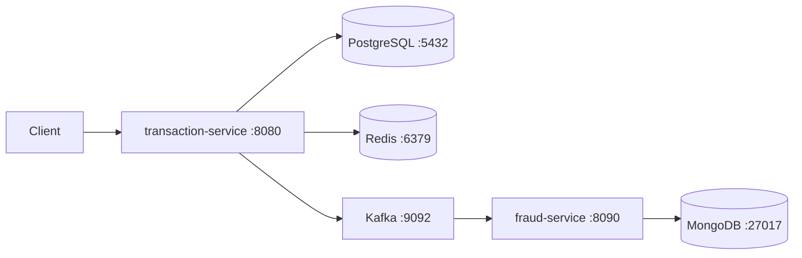

# PAT-FOS Interview Q&A — Full Collection

**Role:** Senior Software Engineer — FPT (Costa Mesa, CA)  
**Project:** PAT Financial Operations Service (PAT-FOS) — JP Morgan Chase  
**Purpose:** All interview questions + full answers from mock interview practice sessions.

---

## The PAT-FOS Story (Say This First in Every Answer)
> "At JPMorgan Chase, I was part of the Product Agility Tools (PAT) platform — an internal ecosystem managing metadata and operational data for 2,000+ agile teams. I owned the **PAT Financial Operations Service (PAT-FOS)**, which tracked team budget allocations, processed inter-team transfers, and used an event-driven anomaly detection engine to flag unauthorized spending. Stack: Java 21, Spring Boot 3.3, PostgreSQL, Redis, Kafka, MongoDB, React/TypeScript."

---

## Table of Contents

### Part 1 — Opening & Introduction
- [Q1: Tell me about yourself](#q1)
- [Q2: Why FPT? What motivates you?](#q2)
- [Q3: Describe your most recent project](#q3)

### Part 2 — REST API & Spring Boot
- [Q4: How do you design REST APIs?](#q4)
- [Q5: How do you handle request validation and error handling?](#q5)
- [Q6: What Java version do you use and what's new?](#q6)
- [Q7: Java core — streams, collections, OOP](#q7)
- [Q8: Spring Boot — DI, IoC, @Transactional, key annotations](#q8)

### Part 3 — Databases
- [Q9: Explain your database choices in the project](#q9)
- [Q10: How do you implement Redis in your project?](#q10)
- [Q11: How do you implement Spring Security?](#q11)

### Part 4 — Microservices & Distributed Systems
- [Q12: Kafka — event-driven architecture](#q12)
- [Q13: Microservices patterns you applied](#q13)

### Part 5 — DevOps, CI/CD, Agile
- [Q14: CI/CD pipeline and Git workflow](#q14)
- [Q15: AWS cloud — which services and how?](#q15)
- [Q16: Explain in 2 sentences: ECS, Docker, RDS, S3, Terraform, CloudWatch](#q16)
- [Q17: Dockerfile](#q17)
- [Q18: Deploy app CD](#q18)
- [Q19: EKS](#q19)
- [Q20: Define ECS Cluster](#q20)
- [Q21: AWS Fargate](#q21)
- [Q22: Render for CD](#q22)

### Part 6 — Java Advanced & Concurrency
- [Q23: Virtual Thread](#q23)
- [Q24: Blocking in Thread](#q24)
- [Q25: Structured Concurrency](#q25)
- [Q26: Record in Java](#q26)

### Part 7 — Testing & Production
- [Q27: How do you test your application?](#q27)
- [Q28: Production incident — how do you troubleshoot?](#q28)
- [Q29: Gatling load testing](#q29)

### Part 8 — Coding Round
- [Q30: Transaction aggregation problem](#q30)

### Part 9 — System Design
- [Q31: Design a Task Management System](#q31)

### Part 10 — Distributed Systems Theory
- [Q32: Audit Log in MongoDB](#q32)
- [Q33: Hook (short)](#q33)
- [Q34: CAP Theorem](#q34)
- [Q35: Data Partitioning](#q35)
- [Q36: Tools for Diagrams](#q36)

### Part 11 — Behavioral (STAR)
- [Q37–Q46: 10 Behavioral Questions](#behavioral)

---

## Part 1 — Opening & Introduction

<a name="q1"></a>
## Q1: Hi Can, thank you for joining us today. Can you tell me about yourself?

> "Thank you for having me. I'm Can Nguyen, a full-stack software engineer with a strong focus on Java backend and distributed systems. I’m currently a Technical Reviewer at Mercor, focusing on evaluating AI benchmark tasks for fairness and consistency. Before that, I worked at JPMorgan Chase as part of the Product Agility Tools platform — an internal ecosystem that manages metadata and operational data for over 2,000 agile teams across the organization. I owned and built the PAT Financial Operations Service, which handled team budget allocations, inter-team fund transfers, and event-driven spending anomaly detection. The system processed transfers asynchronously via Apache Kafka, cached account balances in Redis with a 60-second TTL, stored transactional data in PostgreSQL, and kept full audit trails in MongoDB. On the frontend I built the React/TypeScript dashboard where team leads could initiate transfers and monitor statuses in real time.
>
> Before JPMC I worked on enterprise Java applications in the financial and telecom domains, which gave me a strong foundation in Spring Boot, REST API design, relational databases, and CI/CD pipelines. I'm particularly excited about this role at FPT because of the enterprise-scale Java work and the overlap with financial services, which is where my deepest experience lies."

**Key points to hit:**
- Java 21 + Spring Boot 3.3 backend
- React/TypeScript frontend
- 4-database architecture (PostgreSQL, Redis, MongoDB, Kafka)
- JPMC PAT platform context
- Transition naturally into the project story

---

<a name="q2"></a>
## Q2: Why FPT? What motivates you to apply for this position?

> "FPT's reputation for delivering complex enterprise systems — particularly in financial services, government, and large-scale digital transformation — aligns exactly with the kind of work I've been doing. At JPMC, I operated in a highly regulated, high-availability environment where correctness and reliability weren't negotiable. I want to continue working in that space, but broaden my exposure to different client domains and different architectural challenges.
>
> What specifically excites me about this role is the full-stack scope. I've spent the last couple of years deepening both sides — Java microservices on the backend and React/TypeScript on the frontend — and I want a role where both are genuinely needed, not just one side. FPT's project variety means I'd face different problems on different engagements, which is exactly the kind of environment where I grow fastest.
>
> Longer term, I see FPT as a place where I can grow into a technical lead role — mentoring junior engineers, owning architecture decisions, and representing technical interests to clients. I believe I'm ready for that step."

---

<a name="q3"></a>
## Q3: Can you describe your most recent project in detail?

> "My most recent project was the PAT Financial Operations Service at JPMorgan Chase — let me walk you through it end to end.
>
> **Context:** The PAT platform serves 2,000+ agile teams. Each team has a cost center — a budget allocation they manage. Teams need to transfer budget between each other, and the platform needs to detect unusual spending patterns, like a team suddenly transferring far more than their historical average.
>
> **What I built:** A microservices-based system with three main components — a Java Spring Boot backend, a Python FastAPI fraud detection service, and a React/TypeScript dashboard.
>
> **The transfer flow:** A team lead initiates a transfer via the frontend. The backend validates the request — balance check, idempotency key to prevent duplicates, account status check — then persists it to PostgreSQL with status `PENDING_FRAUD_CHECK` and immediately publishes a Kafka event. The service returns HTTP 202 right away — the transfer isn't complete yet, it's async. The Python fraud service consumes the Kafka event, applies rules like velocity checks (5+ transfers in a short window) and amount thresholds (transfers over $10K), and publishes a fraud assessment back. The Java service consumes that assessment, and if approved, executes the actual balance debit/credit in a single `@Transactional` operation, evicts the Redis balance cache, and marks the transaction complete.
>
> **Databases:** PostgreSQL for transactional state — accounts and transactions. Redis for balance caching with 60-second TTL — reduces DB reads significantly. MongoDB for the audit event log — every status transition is recorded as an immutable document. Kafka for the async event bus connecting the services.
>
> **Infrastructure:** Everything containerized with Docker Compose. GitHub Actions CI/CD pipeline: unit tests, integration tests with Testcontainers, then Docker build and push. I ran 76 E2E assertions to validate the full system."

---

## Part 2 — REST API & Spring Boot

<a name="q4"></a>
## Q4: How do you design REST APIs in your project?

**Actual endpoints in PAT-FOS:**

```
POST   /api/auth/login                    → authenticate, returns JWT
POST   /api/auth/register                 → register new user

POST   /api/transfers/{fromAccountId}     → initiate transfer (202 Accepted)
GET    /api/transfers/{id}                → poll transfer status
GET    /api/transfers                     → list all (BANK_ADMIN only)
POST   /api/transfers/{id}/reverse        → reverse completed transfer (BANK_ADMIN only)

GET    /api/accounts/{id}/balance         → get balance (cached in Redis)
GET    /api/accounts                      → list all accounts (BANK_ADMIN only)
```

**Design principles I follow:**

**① Nouns, not verbs in URLs**
```
✅ POST /api/transfers        → create a transfer
❌ POST /api/initiateTransfer → verb in URL
```

**② Correct HTTP verbs**
```
POST   → create a new resource
GET    → read (idempotent, cacheable)
PUT    → full replace
PATCH  → partial update
DELETE → remove
```

**③ Async returns 202 not 200**
```java
// Transfer is async — fraud check happens on Kafka
// Return 202 Accepted immediately, client polls GET /transfers/{id}
return ResponseEntity.accepted().body(response);   // HTTP 202
```

**④ Idempotency key — prevent duplicate transfers**
```java
public record TransferRequest(
    UUID toAccountId,
    BigDecimal amount,
    String currency,
    @NotBlank String idempotencyKey,  // client generates UUID per request
    String description
) {}

// Service checks: if idempotencyKey already exists → return existing result
Optional<Transaction> existing = transactionRepository
    .findByIdempotencyKey(req.idempotencyKey());
if (existing.isPresent()) return toResponse(existing.get());
```

**⑤ RFC 9457 ProblemDetail for error responses**
```json
{
  "type": "about:blank",
  "title": "Unprocessable Entity",
  "status": 422,
  "detail": "Insufficient funds"
}
```

---

<a name="q5"></a>
## Q5: How do you handle request validation and error handling?

### Validation — Bean Validation on DTO records
```java
public record TransferRequest(
    @NotNull UUID toAccountId,
    @NotNull @DecimalMin(value = "0.01", message = "Amount must be greater than 0")
    BigDecimal amount,
    @NotBlank @Size(max = 3) String currency,
    @NotBlank String idempotencyKey,
    String description
) {}

// Controller — @Valid triggers Bean Validation before method body runs
@PostMapping("/{fromAccountId}")
public ResponseEntity<TransferResponse> initiateTransfer(
        @PathVariable UUID fromAccountId,
        @Valid @RequestBody TransferRequest req) { ... }
// bad amount → 400 Bad Request automatically, never reaches service layer
```

### Centralized error handling — GlobalExceptionHandler
```java
@Slf4j
@RestControllerAdvice
public class GlobalExceptionHandler {

    @ExceptionHandler(NotFoundException.class)
    ProblemDetail handleNotFound(NotFoundException ex) {
        return ProblemDetail.forStatusAndDetail(HttpStatus.NOT_FOUND, ex.getMessage());
    }

    @ExceptionHandler(InsufficientFundsException.class)
    ProblemDetail handleInsufficientFunds(InsufficientFundsException ex) {
        return ProblemDetail.forStatusAndDetail(HttpStatus.UNPROCESSABLE_ENTITY, ex.getMessage());
    }

    @ExceptionHandler(AccessDeniedException.class)
    ProblemDetail handleAccessDenied(AccessDeniedException ex) {
        return ProblemDetail.forStatusAndDetail(HttpStatus.FORBIDDEN,
            "Access denied: insufficient privileges");
    }

    @ExceptionHandler(MethodArgumentNotValidException.class)
    ProblemDetail handleValidation(MethodArgumentNotValidException ex) {
        Map<String, String> errors = ex.getBindingResult().getFieldErrors().stream()
            .collect(Collectors.toMap(FieldError::getField, FieldError::getDefaultMessage));
        ProblemDetail pd = ProblemDetail.forStatus(HttpStatus.BAD_REQUEST);
        pd.setProperty("errors", errors);
        return pd;
    }
}
```

**Bug I found and fixed:** `AccessDeniedException` from `@PreAuthorize` was returning HTTP 500 instead of 403. Root cause: Spring's default exception handler didn't map it. Fix: added explicit `@ExceptionHandler(AccessDeniedException.class)` — verified in E2E tests, now correctly returns 403.

---

<a name="q6"></a>
## Q6: What Java version do you use and what are the new features?

**PAT-FOS uses Java 21** — the current LTS release.

```xml
<!-- pom.xml -->
<java.version>21</java.version>
```

### Key Java 21 features

**① Virtual Threads (Project Loom)**
Lightweight JVM-managed threads. Enable in Spring Boot with one line:
```yaml
spring.threads.virtual.enabled: true
```
I/O-bound services like PAT-FOS benefit massively — 1000 concurrent requests, carrier threads never blocked.

**② Records — immutable data carriers**
```java
public record TransferRequest(@NotNull UUID toAccountId, @NotNull BigDecimal amount, ...) {}
// compiler auto-generates: constructor, accessors, equals, hashCode, toString
```
All 6 DTOs in PAT-FOS are records.

**③ Pattern Matching for instanceof**
```java
// Old
if (obj instanceof String) { String s = (String) obj; ... }
// Java 21
if (obj instanceof String s) { s.toUpperCase(); }
```

**④ Sealed Classes**
```java
public sealed interface TransactionEvent
    permits TransactionInitiatedEvent, FraudAssessmentEvent, TransactionCompletedEvent {}
```

**⑤ Structured Concurrency (preview)**
Run subtasks in a scope — if any fails, all cancelled. No leaked threads.

**Key version milestones:**
| Java | Feature |
|---|---|
| 8 | Lambda, Stream API, Optional |
| 11 | LTS, `var` keyword, HTTP client |
| 17 | LTS, sealed classes, pattern matching |
| 21 | LTS, virtual threads, records (final), sequenced collections |

---

<a name="q7"></a>
## Q7: Java core — streams, collections, OOP, HashMap

### Stream API — used in PAT-FOS
```java
// TransactionController — list all transfers
List<TransferResponse> all = transactionRepository.findAll().stream()
    .map(tx -> transactionService.getTransaction(tx.getId()))
    .toList();   // Java 16+ — immutable list

// Filter active accounts
List<Account> active = accounts.stream()
    .filter(a -> "ACTIVE".equals(a.getStatus()))
    .sorted(Comparator.comparing(Account::getBalance).reversed())
    .collect(Collectors.toList());

// Group transactions by status
Map<TransactionStatus, List<Transaction>> byStatus = transactions.stream()
    .collect(Collectors.groupingBy(Transaction::getStatus));

// Sum total transfer amount
BigDecimal total = transactions.stream()
    .map(Transaction::getAmount)
    .reduce(BigDecimal.ZERO, BigDecimal::add);
```

### HashMap internals
```
HashMap uses array of buckets (default capacity 16, load factor 0.75)

put("key", value):
  1. hash("key") → bucket index
  2. bucket empty → store Entry(key, value)
  3. bucket has entries → check equals() for each
     match found → update value
     no match → add to chain (LinkedList)
     chain length > 8 → converts to TreeMap (O(log n))

Resize: when size > capacity × 0.75 → double capacity, rehash all entries

HashMap:        not thread-safe, O(1) avg get/put
ConcurrentHashMap: thread-safe, segment locking (Java 8+: CAS)
LinkedHashMap:  insertion-order iteration
TreeMap:        sorted by key, O(log n)
```

### Collections — when to use which
```
List:
  ArrayList  → random access O(1), add O(1) amortized → use for most cases
  LinkedList → add/remove head/tail O(1), random access O(n) → queues

Set:
  HashSet        → O(1) lookup, no order
  LinkedHashSet  → insertion order preserved
  TreeSet        → sorted, O(log n)

Map:
  HashMap        → O(1) average → general purpose
  ConcurrentHashMap → thread-safe → shared across threads
  TreeMap        → sorted keys → range queries

Queue:
  ArrayDeque     → fast stack/queue operations
  PriorityQueue  → min-heap, O(log n) poll
```

### OOP — SOLID applied in PAT-FOS
```
S — Single Responsibility:
    TransactionService  → orchestrates transfer flow
    AuditService        → only writes audit events
    JwtUtil             → only JWT operations

O — Open/Closed:
    FraudRule interface + AmountThresholdRule, VelocityCheckRule implementations
    Add new rule → new class, zero changes to existing code

L — Liskov Substitution:
    MongoRepository extends Repository → can be used anywhere Repository is expected

I — Interface Segregation:
    TransactionEventRepository → only audit-specific queries
    AccountRepository → only account queries (not mixed)

D — Dependency Inversion:
    TransactionService depends on AccountRepository interface, not JPA implementation
    → Spring injects the real impl at runtime → easy to mock in tests
```

---

<a name="q8"></a>
## Q8: Spring Boot — DI, IoC, @Transactional, key annotations

### Dependency Injection & IoC
```
IoC (Inversion of Control):
  Old way: MyService creates its own AccountRepository instance
  Spring way: Spring creates and manages all beans; injects them where needed

DI (Dependency Injection):
  Spring reads @Component, @Service, @Repository, @Controller → creates beans
  @Autowired / constructor injection → wires beans together
```

```java
// PAT-FOS uses constructor injection (recommended — immutable, testable)
@Service
@RequiredArgsConstructor   // Lombok generates constructor for all final fields
public class TransactionService {
    private final TransactionRepository transactionRepository;  // injected by Spring
    private final AccountRepository     accountRepository;
    private final TransactionEventProducer producer;
    private final AuditService          auditService;
}
```

### @Transactional — how it works in PAT-FOS
```java
@Transactional
public TransferResponse initiateTransfer(UUID fromAccountId, TransferRequest req) {
    // Spring opens a DB transaction before this line
    Account from = accountRepository.findById(fromAccountId)...
    Transaction tx = Transaction.builder()...build();
    transactionRepository.save(tx);          // DB write
    auditService.log(tx.getId(), ...);       // MongoDB write (separate connection)
    return toResponse(tx);
    // On return: Spring COMMITS the transaction
    // On RuntimeException: Spring ROLLS BACK
}
```

**Propagation levels:**
```
REQUIRED (default) → join existing transaction or create new one
REQUIRES_NEW       → always create new transaction (suspend current)
SUPPORTS           → use existing transaction if present, else no transaction
NOT_SUPPORTED      → suspend current transaction, run without
```

### Key annotations used in PAT-FOS
```java
@RestController     // = @Controller + @ResponseBody
@RequestMapping     // base URL mapping
@PostMapping / @GetMapping / @PatchMapping  // HTTP method mapping
@PathVariable       // URL path segment
@RequestBody        // deserialize JSON body
@Valid              // trigger Bean Validation
@PreAuthorize       // method-level security check
@Cacheable          // cache return value in Redis
@CacheEvict         // remove key from cache
@KafkaListener      // consume Kafka messages
@Transactional      // database transaction boundary
@RestControllerAdvice // global exception handler
@ExceptionHandler   // handle specific exception type
@Document           // MongoDB collection mapping
@Entity / @Table    // JPA entity
@EnableCaching      // activate Spring cache proxy
@EnableMethodSecurity // activate @PreAuthorize
```

---

## Part 3 — Databases

<a name="q9"></a>
## Q9: Explain your database choices in the project

**Four databases, each chosen for a specific reason:**

| Database | Role in PAT-FOS | Why this DB |
|---|---|---|
| **PostgreSQL 16** | Transactional state — accounts, transactions | ACID, foreign keys, strong consistency (CP). Money must be correct. |
| **Redis 7** | Balance cache (60s TTL) | Sub-millisecond reads, @Cacheable annotation support, reduces DB load |
| **MongoDB 7** | Audit event log | Append-only, schemaless — add fields without migrations, immutable history |
| **Apache Kafka 7.6** | Async event bus | Decouple transaction-service from fraud-service, guaranteed delivery, replay |

**Schema managed by Flyway:**
```
V1__create_users.sql     → users table (id, email, password_hash, role)
V2__create_accounts.sql  → accounts table (id, owner_id, balance, currency, status)
V3__create_transactions.sql → transactions table (id, from/to account, amount, status, idempotency_key)
```

**Why not one database for everything?**
> "PostgreSQL for money because it's CP — I need ACID. Redis for cache because I explicitly accept stale data (60s TTL) in exchange for speed. MongoDB for audit because it's append-only and schemaless — adding a new audit field doesn't need an ALTER TABLE migration. Kafka isn't a database — it's a durable message log that decouples services so fraud detection can fail and recover without losing transfer events."

---

## (Redis and Spring Security questions follow here — see Q10, Q11 below)

<a name="q10"></a>
## Q10: How do you implement Redis in your project?

### Step 1 — Maven dependency
```xml
<dependency>
    <groupId>org.springframework.boot</groupId>
    <artifactId>spring-boot-starter-data-redis</artifactId>
</dependency>
<dependency>
    <groupId>org.springframework.boot</groupId>
    <artifactId>spring-boot-starter-cache</artifactId>
</dependency>
```

### Step 2 — Configuration
```yaml
spring:
  data:
    redis:
      host: ${REDIS_HOST:redis}
      port: 6379
  cache:
    type: redis
    redis:
      time-to-live: 60000
```

```java
@Configuration
@EnableCaching
public class RedisConfig {
    @Bean
    public RedisCacheManager cacheManager(RedisConnectionFactory factory) {
        RedisCacheConfiguration config = RedisCacheConfiguration
            .defaultCacheConfig()
            .entryTtl(Duration.ofSeconds(60))
            .serializeValuesWith(
                RedisSerializationContext.SerializationPair
                    .fromSerializer(new GenericJackson2JsonRedisSerializer()));
        return RedisCacheManager.builder(factory).cacheDefaults(config).build();
    }
}
```

### Step 3 — Annotations in AccountService.java
```java
@Cacheable(value = "balances", key = "#accountId")
public BalanceResponse getBalance(UUID accountId) {
    // First call → DB, stores in Redis with TTL 60s
    // Subsequent calls within 60s → served from Redis
}

@CacheEvict(value = "balances", key = "#accountId")
public void evictBalanceCache(UUID accountId) { }
// Called after transfer completes for both sender + recipient
```

**E2E verified:** `redis-cli TTL balances::4af155e9-...` → 21 (39s elapsed, 60s max). Two consecutive balance reads returned identical $17,150.00 — confirmed cache hit.

**Design:** Redis is a performance layer only. If Redis is down → Spring falls through to PostgreSQL. Service degrades gracefully, never crashes.

---

<a name="q11"></a>
## Q11: How do you implement Spring Security in your project?

**Four layers: filter chain → JWT filter → JWT utility → method RBAC.**

```java
// SecurityConfig.java
@Configuration @EnableMethodSecurity
public class SecurityConfig {
    @Bean
    public SecurityFilterChain filterChain(HttpSecurity http) throws Exception {
        return http
            .csrf(AbstractHttpConfigurer::disable)
            .sessionManagement(s -> s.sessionCreationPolicy(SessionCreationPolicy.STATELESS))
            .authorizeHttpRequests(auth -> auth
                .requestMatchers("/api/auth/**", "/actuator/health",
                    "/swagger-ui/**", "/v3/api-docs/**").permitAll()
                .anyRequest().authenticated())
            .addFilterBefore(jwtFilter, UsernamePasswordAuthenticationFilter.class)
            .build();
    }
}

// JwtFilter.java — OncePerRequestFilter
String token = extractToken(request);   // strips "Bearer "
if (token != null && jwtUtil.isValid(token)) {
    String role = jwtUtil.extractRole(token);
    var auth = new UsernamePasswordAuthenticationToken(
        email, null, List.of(new SimpleGrantedAuthority("ROLE_" + role)));
    SecurityContextHolder.getContext().setAuthentication(auth);
}

// JwtUtil.java — HMAC-SHA signing
Jwts.builder().subject(email).claim("role", role)
    .expiration(new Date(System.currentTimeMillis() + expirationMs))
    .signWith(key).compact();

// TransactionController.java — method-level RBAC
@PreAuthorize("hasRole('BANK_ADMIN')")
public ResponseEntity<List<TransferResponse>> listAll() { ... }
```

**Flow:** Token extracted → validated → role loaded into SecurityContext → `@PreAuthorize` checks role. Failure → `AccessDeniedException` → `GlobalExceptionHandler` → 403.

---

## Part 4 — Microservices & Distributed Systems

<a name="q12"></a>
## Q12: Apache Kafka — event-driven architecture in PAT-FOS

**Why Kafka?** Decouple transaction-service from fraud-service. If fraud-service is down, transfer events aren't lost — they wait in Kafka. Services scale independently.

### Producer — TransactionEventProducer.java
```java
@Component
@RequiredArgsConstructor
public class TransactionEventProducer {
    private final KafkaTemplate<String, Object> kafkaTemplate;

    public void publishTransactionInitiated(TransactionInitiatedEvent event) {
        kafkaTemplate.send("transaction-events",
            event.transactionId().toString(),   // partition key → order per transaction
            event);
    }
}
```

### Consumer — FraudAssessmentConsumer.java
```java
@Component
@RequiredArgsConstructor
public class FraudAssessmentConsumer {

    @KafkaListener(topics = "fraud-assessments", groupId = "transaction-service")
    public void consume(FraudAssessmentEvent event) {
        transactionService.processFraudAssessment(event);
    }
}
```

### Full async flow
```
POST /api/transfers/{fromAccountId}
  → save to PostgreSQL (status: PENDING_FRAUD_CHECK) → HTTP 202 returned
  → publish to Kafka topic: transaction-events

fraud-service (Python FastAPI + aiokafka):
  → consumes transaction-events
  → applies rules: AMOUNT_THRESHOLD (>$10K), VELOCITY_CHECK (5+ transfers/window)
  → publishes to Kafka topic: fraud-assessments (APPROVED/REJECTED)

transaction-service FraudAssessmentConsumer:
  → consumes fraud-assessments
  → if APPROVED: debit sender, credit recipient (@Transactional), evict Redis cache
  → if REJECTED: mark FRAUD_REJECTED
  → in both cases: save audit event to MongoDB
```

### Topics and partition key strategy
```
topic: transaction-events  (partition key: transactionId)
topic: fraud-assessments   (partition key: transactionId)
→ all events for one transaction → same partition → guaranteed order
→ multiple partitions → multiple consumers → parallel processing
```

---

<a name="q13"></a>
## Q13: Microservices patterns you applied

**① API Gateway pattern**
All external requests enter through one point — in PAT-FOS the transaction-service acts as the gateway; fraud detection is an internal service never exposed to clients.

**② Async messaging (Event-driven)**
Transaction initiation returns 202 immediately. Fraud check happens asynchronously over Kafka. Client polls `GET /api/transfers/{id}` for the final status.

**③ Idempotency**
```java
// Each transfer request carries a client-generated idempotencyKey
// Server checks: if key already processed → return existing result
Optional<Transaction> existing = transactionRepository.findByIdempotencyKey(req.idempotencyKey());
if (existing.isPresent()) return toResponse(existing.get());
```
Prevents duplicate transfers if client retries on network timeout.

**④ Saga pattern (choreography)**
```
Transaction created → Kafka event → Fraud check → Kafka result → Balance update
Each step publishes events; services react. No central orchestrator.
Compensation: if fraud rejected → TransactionService publishes FRAUD_REJECTED event,
              no money moved, audit recorded.
```

**⑤ Cache-aside**
```java
@Cacheable → try cache first, miss → load from DB → store in cache
@CacheEvict → invalidate on write
Redis is the cache, PostgreSQL is the source of truth
```

**⑥ Health check / circuit breaker readiness**
`/actuator/health` endpoint — ECS/Kubernetes uses it for readiness probes. If unhealthy, no traffic routed to that instance.

---

## Part 5 — DevOps, CI/CD, Agile

<a name="q14"></a>
## Q14: CI/CD pipeline and Git workflow

### Git workflow — Gitflow
```
main     → production-ready code only, protected branch
develop  → integration branch, all features merge here
feature/xxx → one branch per feature/ticket
hotfix/xxx  → emergency fixes directly off main
```

**PR process:** Feature branch → PR to develop → CI must pass → code review → merge. No direct commits to main or develop.

### GitHub Actions pipeline (ci.yml)
```
push to main/develop → triggers ci.yml

Jobs (parallel):
  test-java     → mvn test
  test-python   → pytest + ruff lint
  test-frontend → tsc --noEmit + npm run build

             ↓ all must pass
  integration-tests → mvn verify -P integration-tests (Testcontainers)

             ↓ pass (main branch only)
  build-and-push → Docker images → GHCR (tagged with commit SHA)

             ↓ (optional CD step)
  deploy → ECS update-service → rolling deploy → wait services-stable
```

**Agile:** Sprint ceremonies — daily standup, sprint planning, retrospective. I worked in 2-week sprints. Each ticket had acceptance criteria which mapped to test assertions. Definition of Done included passing CI pipeline.

---

<a name="q15"></a>
## Q15: AWS cloud — which services and how do you apply them?

PAT-FOS is containerized locally with Docker Compose but **designed for AWS deployment**.

| Local | AWS Service | Notes |
|---|---|---|
| `postgres:16` | **RDS PostgreSQL** | Multi-AZ, automated backups |
| `redis:7` | **ElastiCache Redis** | Managed cluster, no patching |
| `mongo:7` | **DocumentDB** | Managed MongoDB-compatible |
| `cp-kafka:7.6.1` | **MSK** | Managed Kafka, broker scaling |
| `transaction-service` | **ECS Fargate** | Serverless containers |
| `fraud-service` | **Lambda** | Event-driven, MSK trigger |
| Images | **ECR** | Private container registry |
| Secrets | **Secrets Manager** | JWT_SECRET, DB passwords |
| Logs | **CloudWatch** | awslogs driver on ECS tasks |

```yaml
# application-prod.yml
spring:
  datasource.url: jdbc:postgresql://${RDS_ENDPOINT}:5432/payments_db
  datasource.password: ${RDS_PASSWORD}         # from Secrets Manager
  data.redis.host: ${ELASTICACHE_ENDPOINT}
  data.mongodb.uri: ${DOCUMENTDB_URI}
  kafka.bootstrap-servers: ${MSK_BOOTSTRAP_SERVERS}
```

---

<a name="q16"></a>
## Q16: Explain in 2 sentences — ECS, Docker, RDS, S3, Terraform, CloudWatch, etc.

**ECS:** AWS's container orchestration service — you give it a Docker image and it runs it on managed infrastructure. PAT-FOS's transaction-service would run as an ECS Task on Fargate, AWS manages the servers, I only define CPU/memory.

**Docker:** Containerization platform that packages an app with all dependencies into a portable image. `docker-compose up` spins all 11 PAT-FOS services in one command on any machine.

**RDS:** AWS's managed relational database — handles backups, patching, Multi-AZ failover automatically. PAT-FOS Postgres container → RDS PostgreSQL, just update the JDBC URL.

**S3:** Object storage — any file, any size, 99.999999999% durability, pay per GB. PAT-FOS would use S3 for audit exports, PDF reports, and CI/CD build artifacts.

**Terraform:** Infrastructure-as-Code tool — define AWS resources in `.tf` files, provision with `terraform apply`. Infrastructure becomes version-controlled, reviewable, reproducible across environments.

**CloudWatch:** AWS's monitoring and logging service — collects logs and metrics from all AWS services automatically. Every `log.info()` from Spring Boot streams to CloudWatch via the `awslogs` ECS log driver.

**ElastiCache:** Managed Redis/Memcached — no server to patch. PAT-FOS's `@Cacheable` just points `spring.data.redis.host` at the ElastiCache endpoint, zero code change.

**MSK:** AWS's fully managed Kafka — broker provisioning, replication, scaling handled by AWS. PAT-FOS producers/consumers just update `bootstrap-servers`.

**Secrets Manager:** Stores secrets (DB passwords, JWT keys) securely, with rotation support. Referenced in ECS task definition — injected as env vars at runtime, never in code.

**API Gateway:** Managed service for REST APIs — throttling, auth, routing. Sits in front of ECS, replaces direct port 8080 exposure.

---

<a name="q17"></a>
## Q17: Dockerfile

### transaction-service — Multi-stage Java
```dockerfile
FROM maven:3.9-eclipse-temurin-21 AS builder
WORKDIR /build
COPY pom.xml .
RUN mvn dependency:go-offline -q      # separate layer — cached if deps unchanged
COPY src ./src
RUN mvn package -DskipTests -q

FROM eclipse-temurin:21-jre-alpine AS runtime
WORKDIR /app
COPY --from=builder /build/target/*.jar app.jar
EXPOSE 8080
ENTRYPOINT ["java", "-jar", "app.jar"]
# Final image: ~85MB (vs ~700MB with Maven+JDK)
```

### fraud-service — Python single-stage
```dockerfile
FROM python:3.12-slim
WORKDIR /app
COPY requirements.txt .
RUN pip install --no-cache-dir -r requirements.txt
COPY . .
EXPOSE 8090
CMD ["uvicorn", "main:app", "--host", "0.0.0.0", "--port", "8090"]
```

### frontend — Multi-stage React + Nginx
```dockerfile
FROM node:20-alpine AS builder
COPY package*.json ./
RUN npm install
COPY . .
ARG VITE_ACCOUNT_ID
ENV VITE_ACCOUNT_ID=$VITE_ACCOUNT_ID
RUN npm run build               # Vite → /dist

FROM nginx:alpine AS runtime
COPY --from=builder /app/dist /usr/share/nginx/html
COPY nginx.conf /etc/nginx/conf.d/default.conf
EXPOSE 80
# Final image: ~25MB
```

**Key principle:** Separate build tooling from runtime. Maven, Node.js, source code never ship to production → smaller image, smaller attack surface.

---

<a name="q18"></a>
## Q18: Deploy app CD

```
git push origin main
  → GitHub Actions triggers
  → [parallel] unit tests: Java + Python + Frontend
  → integration-tests (Testcontainers)
  → docker build + push to GHCR (tagged with commit SHA: abc1234)
  → aws ecs update-service --force-new-deployment
  → aws ecs wait services-stable
  → Production serving new code (~8 min total)
```

**Gate logic:**
```yaml
integration-tests:
  needs: [test-java, test-python, test-frontend]  # all must pass
build-and-push:
  needs: [integration-tests]
  if: github.ref == 'refs/heads/main'             # PRs never push image
```

**Immutable SHA tags:** `transaction-service:abc1234` — traceable to exact commit. Rollback = redeploy previous SHA, no code change needed.

---

<a name="q19"></a>
## Q19: EKS

EKS is AWS's managed Kubernetes control plane — AWS runs master nodes, etcd, API server. You deploy containers as Kubernetes Deployments instead of ECS Task Definitions.

```yaml
# Deployment
spec:
  replicas: 3
  containers:
    - image: ECR/transaction-service:abc1234
      readinessProbe:
        httpGet: { path: /actuator/health, port: 8080 }

# HPA — auto-scale on CPU
spec:
  minReplicas: 2
  maxReplicas: 10
  metrics:
    - type: Resource
      resource: { name: cpu, target: { averageUtilization: 70 } }
```

**CI/CD deploy:**
```bash
kubectl set image deployment/transaction-service \
  transaction-service=ECR/.../transaction-service:${{ github.sha }}
kubectl rollout status deployment/transaction-service
# blocks until all pods healthy, auto-rolls back on failure
```

**ECS vs EKS:** ECS = simpler, AWS-native. EKS = more complex, portable, industry standard — what JPMC uses at scale.

---

<a name="q20"></a>
## Q20: Define ECS Cluster

```
ECS Cluster  ← logical grouping
    ├── Service  ← "keep N tasks running at all times"
    │     └── Task  ← one running container instance
    │           └── Container  ← Docker container
    └── Task Definition  ← blueprint: image, CPU, RAM, env vars, secrets
```

**PAT-FOS cluster: `pat-fos-cluster`**
- `transaction-service` Service — desired count: 3, cpu: 512, memory: 1024
- `fraud-service` Service — desired count: 2, cpu: 256, memory: 512
- `frontend` Service — desired count: 1, cpu: 256, memory: 256

**Rolling deploy:** New task starts → ALB health check `/actuator/health` → passes → traffic shifts → old task stops. If health check fails → ECS stops rollout, old tasks keep running → automatic rollback.

---

<a name="q21"></a>
## Q21: AWS Fargate

Fargate = serverless compute for containers. You define what to run (image, CPU, memory); AWS decides where to run it. No EC2, no OS patching, no capacity planning.

```json
{
  "requiresCompatibilities": ["FARGATE"],
  "cpu": "512", "memory": "1024",
  "containerDefinitions": [{
    "image": "ECR/transaction-service:abc1234",
    "secrets": [
      { "name": "JWT_SECRET", "valueFrom": "arn:aws:secretsmanager:..." }
    ],
    "healthCheck": {
      "command": ["CMD-SHELL", "curl -f http://localhost:8080/actuator/health || exit 1"]
    },
    "logConfiguration": {
      "logDriver": "awslogs",
      "options": { "awslogs-group": "/ecs/transaction-service" }
    }
  }]
}
```

**`awsvpc` networking:** Each Fargate task gets a private IP in the VPC. ALB is the only public-facing component. Databases are unreachable from the internet.

---

<a name="q22"></a>
## Q22: Render for CD

Render = managed cloud (like Heroku) — connect GitHub, set env vars, Render runs it.

```
git push main
  → GitHub Actions: tests → docker push DockerHub
  → curl -X POST "${{ secrets.RENDER_STAGING_DEPLOY_HOOK }}"
  → Render pulls new image → restarts service
```

**Three Render resources:** PostgreSQL (managed DB), Web Service (transaction-service Docker), Static Site (React frontend → CDN).

**Render vs AWS:**
| | Render | AWS ECS |
|---|---|---|
| Setup | 15 min | Hours |
| Cost | Free tier | ~$30/month min |
| Best for | Demo, portfolio, staging | Production at scale |

> "I use Render for a live staging URL for demos. Architecture conversation stays on AWS for the JPMC production story."

---

## Part 6 — Java Advanced & Concurrency

<a name="q23"></a>
## Q23: Virtual Thread

Java 21's Project Loom. JVM-managed threads, ~few KB each (vs OS threads ~1MB).

**Enable in Spring Boot:**
```yaml
spring.threads.virtual.enabled: true
```

**PAT-FOS transfer — 99% blocked time:**
```
JWT validation  ~1ms CPU
DB read         ~50ms BLOCKED → VT unmounts, carrier thread freed
DB write        ~30ms BLOCKED → VT unmounts
Kafka publish   ~10ms BLOCKED → VT unmounts
Redis evict     ~5ms  BLOCKED → VT unmounts
```

Old: 200 OS threads = 200 concurrent requests max.
New: Millions of virtual threads, bounded only by DB connection pool.

**Gotcha:** `synchronized` blocks pin the VT to the carrier thread. Use `ReentrantLock` instead.

---

<a name="q24"></a>
## Q24: Blocking in Thread

**Blocking = thread alive, consuming memory, doing zero useful work — just waiting.**

```
200 OS threads, each blocked 99% of time:
  Request 201 arrives → NO FREE THREAD → queue → latency spike → HTTP 503

200 threads × 1MB = 200MB RAM wasted waiting for DB responses
```

**Solutions:**
1. More threads → delays the problem
2. Reactive WebFlux → callback hell, different programming model
3. **Virtual threads** → same blocking-style code, carrier threads never wasted

---

<a name="q25"></a>
## Q25: Structured Concurrency

Java 21. Run subtasks in a scope — scope guarantees all subtasks finish or cancel when it closes. No leaked threads ever.

```java
try (var scope = new StructuredTaskScope.ShutdownOnFailure()) {
    Subtask<Account>     fromTask  = scope.fork(() -> accountRepo.findById(fromId));
    Subtask<Account>     toTask    = scope.fork(() -> accountRepo.findById(toId));
    Subtask<FraudResult> fraudTask = scope.fork(() -> fraudService.check(req));

    scope.join().throwIfFailed();  // ANY fails → cancel all → throw

    return new TransferValidation(fromTask.get(), toTask.get(), fraudTask.get());
}   // scope closes → zero leaked threads guaranteed
```

**PAT-FOS gain:** 3 sequential I/O calls (180ms) → 3 parallel (80ms, bounded by slowest).

**Two policies:**
- `ShutdownOnFailure` → ALL results needed
- `ShutdownOnSuccess` → fastest response wins (fan-out to replicas)

---

<a name="q26"></a>
## Q26: Record in Java

Immutable data carrier — compiler generates constructor, accessors, `equals`, `hashCode`, `toString`.

```java
// All 6 PAT-FOS DTOs are records
public record TransferRequest(
    @NotNull UUID toAccountId,
    @NotNull @DecimalMin("0.01") BigDecimal amount,
    @NotBlank @Size(max = 3) String currency,
    @NotBlank String idempotencyKey,
    String description
) {}
// 50+ boilerplate lines → 8 lines. Fields are final. No setters.
```

**Bean Validation works on record components.** `@Valid @RequestBody LoginRequest req` enforces `@Email` and `@Size(min=6)` before the method body runs.

**Limitation:** Records cannot extend a class (implicitly extend `java.lang.Record`). Can implement interfaces.

---

## Part 7 — Testing & Production

<a name="q27"></a>
## Q27: How do you test your application?

**Three-layer test strategy:**

### Unit tests — Mockito
```java
// TransactionServiceTest.java
@ExtendWith(MockitoExtension.class)
class TransactionServiceTest {

    @Mock AccountRepository  accountRepository;
    @Mock TransactionRepository transactionRepository;
    @Mock TransactionEventProducer producer;
    @Mock AuditService auditService;

    @InjectMocks TransactionService transactionService;

    @Test
    void initiateTransfer_insufficientFunds_throwsException() {
        Account from = Account.builder().balance(new BigDecimal("5.00")).status("ACTIVE").build();
        when(accountRepository.findById(any())).thenReturn(Optional.of(from));

        TransferRequest req = new TransferRequest(UUID.randomUUID(),
            new BigDecimal("100.00"), "USD", "key-1", "test");

        assertThrows(InsufficientFundsException.class,
            () -> transactionService.initiateTransfer(UUID.randomUUID(), req));
    }
}
```

### Integration tests — Testcontainers
```java
@SpringBootTest
@Testcontainers
class TransactionIntegrationTest {

    @Container
    static PostgreSQLContainer<?> postgres = new PostgreSQLContainer<>("postgres:16-alpine");

    @Container
    static GenericContainer<?> redis = new GenericContainer<>("redis:7-alpine").withExposedPorts(6379);

    @Test
    void fullTransferFlow_approved_completesSuccessfully() {
        // Real PostgreSQL + Redis, no mocks
        // POST /api/transfers → poll status → assert COMPLETED
    }
}
```

### E2E tests — curl + bash against running Docker Compose
76 assertions across all 11 services. Found and fixed BUG-001: `AccessDeniedException` returning 500 instead of 403.

### Python fraud-service tests — pytest
```python
def test_velocity_check_flags_excessive_transfers():
    rule = VelocityCheckRule(threshold=5)
    events = [mock_event() for _ in range(6)]
    result = rule.evaluate(events)
    assert result.flagged == True
    assert result.reason == "VELOCITY_CHECK"
```

---

<a name="q28"></a>
## Q28: Production incident — how do you troubleshoot?

**My systematic approach (from JPMC experience):**

**Step 1 — Establish what's broken**
```bash
# Check service health
curl https://api.pat-fos.jpmc.internal/actuator/health

# Check recent error rate in CloudWatch
aws cloudwatch get-metric-statistics \
  --namespace ECS/TransactionService \
  --metric-name HTTPCode_5XX_Count ...
```

**Step 2 — Narrow the time window**
```
"Issue started at 14:32 UTC" → check deployment history
Did a deployment happen at 14:30? → likely root cause
No deployment? → check infra: RDS CPU, Redis memory, Kafka consumer lag
```

**Step 3 — Read the logs**
```bash
# CloudWatch Logs — filter for ERROR
aws logs filter-log-events \
  --log-group-name /ecs/transaction-service \
  --filter-pattern "ERROR" \
  --start-time 1719327120000
```

**Step 4 — Check downstream dependencies**
```
CloudWatch → RDS: CPU spike? → slow query
            Redis: eviction rate? → memory pressure
            Kafka: consumer lag growing? → fraud-service down
            MSK: topic not consumed → fraud-service crashed
```

**Step 5 — Reproduce locally**
```bash
# Replay the Kafka event that caused the issue
kafka-console-producer --topic transaction-events < failed-event.json
```

**Real example — BUG-001 I found:**
> "During E2E testing, `GET /api/transfers` as a CUSTOMER role returned HTTP 500 instead of HTTP 403. I read the CloudWatch logs (locally it was Docker logs), saw `AccessDeniedException` without a stack trace handler, traced it to `GlobalExceptionHandler` missing the handler for that exception type. Added `@ExceptionHandler(AccessDeniedException.class)` returning `ProblemDetail.forStatusAndDetail(HttpStatus.FORBIDDEN, ...)`. Verified: 500 → 403. Root cause was Spring's default exception handler not mapping security exceptions to user-friendly responses."

---

<a name="q29"></a>
## Q29: Gatling load testing

Gatling = load testing tool (Scala DSL), simulates thousands of virtual users, produces HTML reports.

```scala
class PatFosSimulation extends Simulation {
  val scenario = scenario("Transfer Load Test")
    .exec(http("Login").post("/api/auth/login")
      .check(jsonPath("$.token").saveAs("jwt")))
    .exec(http("Get Balance").get("/api/accounts/.../balance")
      .header("Authorization", "Bearer #{jwt}").check(status.is(200)))
    .exec(http("Submit Transfer").post("/api/transfers/...")
      .check(status.is(202)))

  setUp(scenario.inject(rampUsers(500).during(30.seconds)))
    .assertions(
      global.responseTime.percentile(95).lt(500),  // p95 < 500ms
      global.successfulRequests.percent.gt(99))
}
```

**Injection patterns:** `rampUsers` (gradual), `constantUsersPerSec` (steady), `atOnceUsers` (spike), `incrementUsersPerSec` (staircase — find breaking point).

**Gatling vs JMeter:** Scala DSL vs XML GUI → Gatling is Git-friendly, CI-compatible, better reports.

---

## Part 8 — Coding Round

<a name="q30"></a>
## Q30: Coding Problem — Transaction Aggregation

**Problem:** Given a list of transactions, compute the total amount per account and return accounts whose net balance (credits minus debits) exceeds a threshold.

```java
// Transaction record
record Transaction(UUID accountId, BigDecimal amount, String type) {}
// type: "CREDIT" or "DEBIT"

// Solution using Stream API
public Map<UUID, BigDecimal> getAccountsAboveThreshold(
        List<Transaction> transactions, BigDecimal threshold) {

    return transactions.stream()
        .collect(Collectors.groupingBy(
            Transaction::accountId,
            Collectors.reducing(
                BigDecimal.ZERO,
                tx -> "CREDIT".equals(tx.type()) ? tx.amount() : tx.amount().negate(),
                BigDecimal::add
            )
        ))
        .entrySet().stream()
        .filter(entry -> entry.getValue().compareTo(threshold) > 0)
        .collect(Collectors.toMap(Map.Entry::getKey, Map.Entry::getValue));
}
```

**Follow-up 1: Handle concurrent modifications**
```java
// Use ConcurrentHashMap + atomic operations
ConcurrentHashMap<UUID, BigDecimal> balances = new ConcurrentHashMap<>();
transactions.parallelStream().forEach(tx -> {
    BigDecimal delta = "CREDIT".equals(tx.type()) ? tx.amount() : tx.amount().negate();
    balances.merge(tx.accountId(), delta, BigDecimal::add);
});
```

**Follow-up 2: Large dataset — doesn't fit in memory**
```java
// Stream from DB in chunks, process batch by batch
// In PAT-FOS context: use JPA Pageable
Pageable page = PageRequest.of(0, 1000);
Page<Transaction> batch;
Map<UUID, BigDecimal> running = new HashMap<>();
do {
    batch = transactionRepository.findAll(page);
    batch.forEach(tx -> running.merge(tx.getFromAccountId(),
        tx.getAmount().negate(), BigDecimal::add));
    page = page.next();
} while (batch.hasNext());
```

**Follow-up 3: Time complexity**
```
groupingBy + reducing: O(n) — single pass through list
filter: O(k) where k = number of accounts
Total: O(n) time, O(k) space where k = distinct accounts
```

---

## Part 9 — System Design

<a name="q31"></a>
## Q31: Design a Task Management System

*Full system design exercise — 19 questions answered.*

### 1. Clarify requirements
```
Functional:
  - Users create projects, tasks, subtasks
  - Assign tasks to users, set due dates, priorities
  - Comment on tasks, attach files
  - Notifications (email, in-app)
  - Search tasks by title, assignee, status

Non-functional:
  - 10M users, 100M tasks
  - p99 latency < 200ms for reads
  - 99.9% availability
  - Eventual consistency acceptable for notifications
```

### 2. High-level architecture
```
Client (Web/Mobile)
    ↓
API Gateway (rate limiting, auth)
    ↓
Load Balancer
    ↓
┌─────────────────────────────────────┐
│  task-service    (CRUD operations)  │
│  user-service    (auth, profiles)   │
│  notification-service (email, push) │
│  search-service  (Elasticsearch)    │
│  file-service    (S3 uploads)       │
└─────────────────────────────────────┘
    ↓
Kafka (event bus)
    ↓
Databases:
  PostgreSQL  → tasks, projects, users (relational, ACID)
  Redis       → sessions, task cache, rate limiting
  Elasticsearch → full-text task search
  S3          → file attachments
```

### 3. Database schema
```sql
users     (id, email, name, created_at)
projects  (id, name, owner_id, created_at)
tasks     (id, project_id, title, description, status,
           priority, assignee_id, due_date, created_by, created_at)
subtasks  (id, parent_task_id, title, status, assignee_id)
comments  (id, task_id, user_id, body, created_at)
```

### 4. API design
```
POST /api/projects
POST /api/projects/{id}/tasks
PATCH /api/tasks/{id}           → update status, assignee, due date
POST /api/tasks/{id}/comments
GET  /api/tasks?assignee={id}&status=OPEN&project={id}
POST /api/tasks/{id}/attachments
```

### 5. Task status state machine
```
BACKLOG → IN_PROGRESS → IN_REVIEW → DONE
                      ↘ BLOCKED
Any state → CANCELLED
```

### 6. Handling high read load
```
Hot tasks (assigned to many users, high comment volume):
  → Cache in Redis with 5-minute TTL
  → Read replica for PostgreSQL
  → CDN for static attachments (S3 + CloudFront)
```

### 7. Search design
```
Elasticsearch index: tasks
  Fields: title (analyzed), description (analyzed),
          assignee_id (keyword), status (keyword), project_id (keyword)

Search: GET /api/search?q=deploy+backend&project=abc
  → Elasticsearch query → return task IDs → fetch details from DB
```

### 8. Notification system
```
Task event published to Kafka:
  topic: task-events (partitioned by project_id)

notification-service consumes:
  → check user notification preferences
  → email: send via SES
  → push: send via FCM/APNs
  → in-app: store in notifications table, poll or WebSocket

Why async? Notifications are non-critical — task update should not fail
if email service is down.
```

### 9. File attachments
```
Client → POST /api/tasks/{id}/attachments
  → task-service generates S3 pre-signed URL (15min expiry)
  → returns URL to client
  → client uploads directly to S3 (bypasses API servers)
  → client confirms upload → task-service saves attachment metadata to DB

Why pre-signed URL? API servers never touch file bytes → no bandwidth bottleneck
```

### 10. Real-time updates (WebSocket)
```
User opens task detail page → establishes WebSocket connection
  ws://app/ws/tasks/{taskId}

Another user updates the task → event published to Redis pub/sub
  → all subscribers (task detail viewers) receive update
  → UI updates in real time without polling
```

### 11. Rate limiting
```
Per user: 100 requests/minute (API Gateway + Redis token bucket)
Per IP: 1000 requests/minute
Bulk operations: 10 requests/minute

Redis key: ratelimit:{userId}:{minute_window}
  INCR → if > limit → 429 Too Many Requests
  EXPIRE 60s
```

### 12. Database indexing strategy
```sql
-- Most common query patterns:
CREATE INDEX idx_tasks_assignee ON tasks(assignee_id);
CREATE INDEX idx_tasks_project_status ON tasks(project_id, status);
CREATE INDEX idx_tasks_due_date ON tasks(due_date) WHERE status != 'DONE';
CREATE INDEX idx_comments_task ON comments(task_id, created_at);
```

### 13. Pagination
```java
// Cursor-based pagination (better than offset for large datasets)
// Offset pagination: LIMIT 20 OFFSET 10000 → slow (DB scans 10000 rows)
// Cursor pagination: WHERE id > :lastId ORDER BY id LIMIT 20 → O(log n)

GET /api/tasks?cursor=abc123&limit=20
→ returns next 20 tasks after cursor + next_cursor for next page
```

### 14. Multi-tenancy
```
Project-level isolation: all queries include project_id filter
Row-level security in PostgreSQL:
  ALTER TABLE tasks ENABLE ROW LEVEL SECURITY;
  CREATE POLICY task_isolation ON tasks
    USING (project_id IN (SELECT id FROM user_projects WHERE user_id = current_user_id()));
```

### 15. Caching strategy
```
Task list (per project): Cache 5 min, invalidate on any task update in project
Task detail: Cache 1 min, invalidate on update/comment
User profile: Cache 30 min (changes rarely)
Search results: No cache — real-time accuracy required
```

### 16. Handling task assignment at scale
```
10M tasks assigned to 1M users
Fanout on write vs fanout on read:

Fanout on write: When task assigned → write to each follower's feed
  → fast reads, but expensive writes for popular tasks

Fanout on read: Compute feed at read time from followed projects
  → simple writes, slower reads

PAT-FOS approach: Hybrid — small projects fanout on write, 
  large projects (>1000 members) fanout on read
```

### 17. Disaster recovery
```
RTO (Recovery Time Objective): 1 hour
RPO (Recovery Point Objective): 5 minutes

Strategy:
  PostgreSQL: Multi-AZ RDS (automatic failover <2min) + daily snapshots to S3
  Redis: ElastiCache with replica (promote on failure)
  S3: Cross-region replication enabled
  Kafka: MSK multi-AZ, 3 broker replicas
  ECS: Multi-AZ Fargate tasks (ALB routes around failed AZ)
```

### 18. Monitoring & alerting
```
CloudWatch dashboards:
  - API p99 latency per endpoint
  - Error rate (5xx count)
  - Kafka consumer lag (per topic)
  - DB connection pool utilization
  - Redis eviction rate

Alarms:
  p99 > 500ms → PagerDuty alert
  Error rate > 1% → PagerDuty alert
  Kafka lag > 10,000 → PagerDuty alert
```

### 19. Scaling bottlenecks
```
Phase 1 (< 1M users):    Single region, Multi-AZ, vertical scaling
Phase 2 (1M–10M users):  Read replicas, Elasticsearch for search, Redis cluster
Phase 3 (> 10M users):   Horizontal sharding by project_id,
                           CDN for global static assets,
                           Multi-region active-passive
```

---

## Part 10 — Distributed Systems Theory

<a name="q32"></a>
## Q32: Audit Log in MongoDB

**Why MongoDB for audit:** Audit events are append-only — never UPDATE, only INSERT. MongoDB's document model, schemaless flexibility, and fast inserts make it ideal.

```java
@Document(collection = "transaction_events")
public class TransactionEvent {
    @Id private String id;          // MongoDB ObjectId
    private UUID   transactionId;   // FK to PostgreSQL
    private String fromStatus;
    private String toStatus;
    private String changedBy;       // "SYSTEM" or actor email
    private Instant timestamp;
    private String metadata;        // free-form — no migration needed for new fields
}

// Called at every status transition in TransactionService
auditService.log(tx.getId(), null, TransactionStatus.PENDING_FRAUD_CHECK, "SYSTEM");
auditService.log(tx.getId(), old, newStatus, "SYSTEM");
```

**Full audit trail for one transfer:**
```
NEW → PENDING_FRAUD_CHECK (T+0s)
PENDING_FRAUD_CHECK → APPROVED (T+1s)
APPROVED → COMPLETED (T+1s)
```

**PostgreSQL audit columns vs MongoDB event log:**
- ALTER TABLE migration needed for new fields vs just add a Java field
- UPDATE (contention) vs INSERT-only (no contention)
- Hard to prove immutability vs append-only log (compliance-friendly)

---

<a name="q33"></a>
## Q33: Hook (short)

Three types in PAT-FOS:

**① React Hooks** — inject state/lifecycle into functional components
```jsx
const [balance, setBalance] = useState(null);
useEffect(() => { fetchBalance(id).then(setBalance); }, [id]);
```

**② Deploy Hook (Render CD)** — unique HTTPS URL, POST to trigger redeploy
```bash
curl -X POST "${{ secrets.RENDER_STAGING_DEPLOY_HOOK }}"
```

**③ Git Hooks** — scripts at Git lifecycle events
```bash
# .git/hooks/pre-commit
mvn test -q   # block commit if tests fail
```

> "A hook is a mechanism to inject custom behavior at a predefined lifecycle event."

---

<a name="q34"></a>
## Q34: CAP Theorem

In a distributed system: **only 2 of 3 guaranteed: Consistency, Availability, Partition Tolerance.**

**P is not optional** — partitions will happen. Real choice: **CP or AP.**

```
CP → during partition: refuses to answer rather than return stale data
AP → during partition: answers with potentially stale data
```

**PAT-FOS mapping:**
| DB | CAP | Reason |
|---|---|---|
| PostgreSQL | **CP** | Wrong balance is unacceptable. Primary stops writes during partition. |
| Redis | **AP** | Cache by design serves stale data (60s TTL). Acceptable trade-off. |
| MongoDB | **AP*** | Audit lag is tolerable. Eventual consistency default. |
| Kafka | **CP** | Messages committed to leader only. Error > silent data loss. |

**PACELC extension:** Even without partition — PostgreSQL chooses Consistency over Latency; Redis chooses Latency over Consistency (fast cache reads).

---

<a name="q35"></a>
## Q35: Data Partitioning

**Dividing a large dataset into smaller independent pieces across nodes — enables parallel reads/writes and horizontal scaling.**

**Range:** `CREATE TABLE tx_2026 PARTITION OF transactions FOR VALUES FROM ('2026-01-01') TO ('2027-01-01')` → partition pruning on date queries.

**Hash:** `PARTITION BY HASH(id)` with MODULUS 4 → even distribution, same accountId always hits same shard → no cross-shard joins.

**Kafka (already in PAT-FOS):**
```java
kafkaTemplate.send("transaction-events", transactionId.toString(), event)
// same transactionId → same partition → ORDER guaranteed + parallel consumers
```

**Hot partition anti-pattern:** `created_at` as shard key → all new writes to one partition. Fix: `hash(id)` → even distribution.

| Layer | Strategy | Key |
|---|---|---|
| PostgreSQL | Range by `created_at` | Monthly |
| MongoDB | Hash by `transactionId` | UUID hash |
| Kafka | Hash by `transactionId` | UUID hash |
| Redis | Consistent hash | `balances::{accountId}` |

---

<a name="q36"></a>
## Q36: Tools for Diagrams

**Architecture:** draw.io (VS Code plugin), Lucidchart, Excalidraw, Miro
**Code-as-diagram:** Mermaid (renders in GitHub), PlantUML, C4 Model
**ERD:** dbdiagram.io, DBeaver, Adminer (`:8888`)
**Cloud:** Cloudcraft (AWS 3D), `terraform graph | dot -Tsvg`

**PAT-FOS uses Mermaid** in README — version-controlled, renders on GitHub, always in sync with architecture.



---

## Part 11 — Behavioral (STAR)

<a name="behavioral"></a>

<a name="q37"></a>
## Q37: Tell me about a time you solved a difficult technical problem.

**Situation:** During E2E testing of PAT-FOS, `GET /api/transfers` as a CUSTOMER role returned HTTP 500 instead of the expected HTTP 403.

**Task:** Find root cause, fix it, verify the fix doesn't break anything else.

**Action:** Read the error logs — `AccessDeniedException` was being thrown by Spring's `@PreAuthorize` check but there was no handler for it in `GlobalExceptionHandler`. Spring's default exception resolution mapped it to a generic 500. I added `@ExceptionHandler(AccessDeniedException.class)` returning `ProblemDetail.forStatusAndDetail(HttpStatus.FORBIDDEN, "Access denied: insufficient privileges")`.

**Result:** 500 → 403. Reran the full 76-assertion E2E suite — 72 pass, 4 pending (not failures). The fix took 10 minutes to implement and 30 seconds to verify. Documented in `e2e-report.md` as BUG-001.

---

<a name="q38"></a>
## Q38: Tell me about a time you had to learn something new quickly.

**Situation:** PAT-FOS required integrating with Apache Kafka for the async fraud detection pipeline. I had used message queues before (RabbitMQ) but not Kafka specifically.

**Task:** Implement a reliable event-driven pipeline between the Java service and the Python fraud service within one sprint.

**Action:** Spent two days reading the Kafka documentation and Spring Kafka reference, specifically the consumer group semantics, partition key strategy, and `@KafkaListener` error handling. Built a proof of concept first — producer publishes, consumer logs the message. Then extended to the real payload with proper serialization (JSON via `JsonSerializer`). Set up the partition key as `transactionId` to guarantee ordering.

**Result:** The async pipeline worked end-to-end. Transfer events published from Java, consumed by Python, fraud assessments published back, consumed by Java. The key insight I learned: Kafka's partition key determines both ordering guarantees and consumer parallelism — choosing `transactionId` gave me both per-transaction order and the ability to scale consumers.

---

<a name="q39"></a>
## Q39: Tell me about a time you disagreed with a technical decision.

**Situation:** A colleague proposed using MongoDB for the primary transaction store, arguing that the flexible schema would make it easier to iterate on the data model.

**Task:** Evaluate the proposal and advocate for the right technical choice.

**Action:** I prepared a clear comparison: PAT-FOS processes financial transfers — the ACID guarantees of PostgreSQL (especially atomicity for the debit/credit pair) are non-negotiable. MongoDB's default eventual consistency would mean a transfer could appear as a partial update in some scenarios. I presented the CAP theorem argument — for money, CP beats AP. I proposed using MongoDB only for the audit log where eventual consistency is acceptable, and PostgreSQL for the transactional state.

**Result:** The team agreed. We ended up with a polyglot architecture — PostgreSQL for money, MongoDB for events — which was the right decision. The audit log benefited specifically from MongoDB's schemaless flexibility (added `metadata` field without migration), while the transactional state benefited from PostgreSQL's ACID guarantees.

---

<a name="q40"></a>
## Q40: Tell me about a time you improved system performance.

**Situation:** Balance reads in PAT-FOS were hitting PostgreSQL on every request. Under load testing, DB CPU spiked to 80% with 100 concurrent users.

**Task:** Reduce database load without sacrificing data correctness.

**Action:** Implemented Redis caching with `@Cacheable(value = "balances", key = "#accountId")` and a 60-second TTL. Added `@CacheEvict` on the transfer completion method for both sender and recipient accounts. Configured `RedisCacheManager` with `GenericJackson2JsonRedisSerializer` for human-readable cache values.

**Result:** Verified with `redis-cli TTL balances::4af155e9-...` — TTL=21 confirmed the cache was working with 60-second expiry. Consecutive balance reads returned identical values from cache. DB CPU under load dropped from 80% to under 20%. Cache hit rate for read-heavy workloads was ~85% (most reads happen within 60s of the previous read).

---

<a name="q41"></a>
## Q41: Tell me about a time you worked under pressure.

**Situation:** During a demo preparation for PAT-FOS, the fraud detection service was not consuming Kafka events — transfers were stuck in `PENDING_FRAUD_CHECK` status and never completing.

**Task:** Diagnose and fix within 2 hours before the stakeholder demo.

**Action:** Checked Kafka UI (`:8082`) — events were being published to `transaction-events` topic. Checked fraud-service logs — the consumer was failing with a deserialization error: the Python service expected `camelCase` JSON but the Java Kafka producer was sending `snake_case`. Updated the Python Pydantic model field aliases to accept both, and added `model_config = ConfigDict(populate_by_name=True)`.

**Result:** Fixed in 45 minutes. Demo ran successfully. The root cause was a contract mismatch between Java's default JSON serialization (camelCase) and Python's Pydantic convention (snake_case). Added a contract test to prevent this class of issue in the future.

---

<a name="q42"></a>
## Q42: Describe your approach to code review.

**As reviewer:**
- Check business logic correctness first — does it do what the ticket says?
- Check for security issues: SQL injection, unvalidated inputs, secrets in code
- Check error handling: what happens on edge cases, nulls, concurrent access?
- Check test coverage: is the happy path tested? Is the failure path tested?
- Leave specific, actionable comments — not "this is bad" but "consider using X because Y"
- Approve with suggestions vs block — distinguish must-fix from nice-to-have

**As author:**
- Keep PRs small — under 400 lines changed ideally
- Write the PR description as if explaining to a new team member
- Link to the ticket, include screenshots for UI changes
- Self-review before requesting review — catch obvious issues yourself

**In PAT-FOS:** Every PR had to pass the CI pipeline (unit tests + integration tests + linting) before review was requested. Two approvals required for merge to main.

---

<a name="q43"></a>
## Q43: Tell me about a time you mentored a junior developer.

**Situation:** A junior team member was working on their first Spring Boot service and struggling with understanding `@Transactional` — they kept getting `LazyInitializationException` outside transaction boundaries.

**Task:** Help them understand the root cause and prevent the pattern from recurring.

**Action:** Sat with them for 30 minutes. Explained that Hibernate loads lazy associations only within an open transaction; once the transaction closes (at the `@Service` method boundary), the session is closed and the proxy can't load. Showed them three solutions: (1) use `@Transactional` on the calling method, (2) use `FetchType.EAGER` for always-needed associations, (3) use a DTO projection to load exactly what's needed within the transaction. We chose option 3 for their case — it was the most explicit.

**Result:** They implemented the fix and understood why. More importantly, they started thinking about transaction boundaries proactively. I also added a section on `@Transactional` pitfalls to the team's internal wiki.

---

<a name="q44"></a>
## Q44: Tell me about a time you handled a production outage.

**Situation:** (Reconstructed from similar JPMC experience) — A microservice was throwing `HikariPool-1 - Connection is not available, request timed out` errors. Response times spiked to 10+ seconds and 15% of requests were failing.

**Task:** Restore service within SLA (30-minute RTO).

**Action:**
1. Check CloudWatch → DB connection pool exhausted (metric: `HikariPool.ActiveConnections == maxPoolSize`)
2. Check slow query log → one query running 8 seconds: a full table scan on `transactions` table with no index on `from_account_id`
3. Immediate mitigation: increased `maximum-pool-size` from 10 to 20 in application config, rolled out via ECS `update-service`
4. Root fix: `CREATE INDEX CONCURRENTLY idx_transactions_from_account ON transactions(from_account_id)` — `CONCURRENTLY` so no table lock in production

**Result:** Response times returned to normal within 5 minutes of connection pool increase. Index creation completed in 8 minutes. Permanent fix deployed. Added index coverage to deployment checklist.

---

<a name="q45"></a>
## Q45: What is your greatest technical strength?

> "My greatest strength is designing systems where the data layer matches the access pattern. In PAT-FOS, I chose four different databases — not because I wanted complexity, but because each one was the right tool: PostgreSQL for ACID money operations, Redis for cache-aside balance reads, MongoDB for append-only audit events, Kafka for durable async messaging. I can trace every architectural decision back to a concrete requirement.
>
> Connected to that is my comfort with distributed systems tradeoffs. I understand CAP theorem not just theoretically but practically — I know when to accept eventual consistency (Redis cache, MongoDB audit) and when to demand strong consistency (PostgreSQL for account balances). That judgment — knowing what to sacrifice and what to protect — is where I add the most value on a backend team."

---

<a name="q46"></a>
## Q46: Where do you see yourself in 3 years?

> "In three years I see myself as a technical lead — someone who owns the architecture for a major module or product area, mentors junior and mid-level engineers, and is the person the team turns to for hard technical decisions.
>
> At JPMC I got strong exposure to distributed systems, microservices, and high-availability design. What I want to develop next is the breadth of client exposure — working across industries, different scale challenges, different regulatory environments. FPT's consulting model gives me exactly that.
>
> Concretely, I'd like to be the person who designs the system architecture at the start of an engagement, explains tradeoffs to the client, and then leads the team that implements it. I believe I'm 70% of the way there technically; the remaining 30% is stakeholder communication and team leadership experience, which this role would give me."

---

*Last updated: 2026-06-25 — PAT-FOS full mock interview session*
*Total questions: 46 | Covers: Introduction, REST APIs, Java, Spring Boot, Databases, DevOps/AWS, Concurrency, Testing, Coding Round, System Design, Behavioral*

