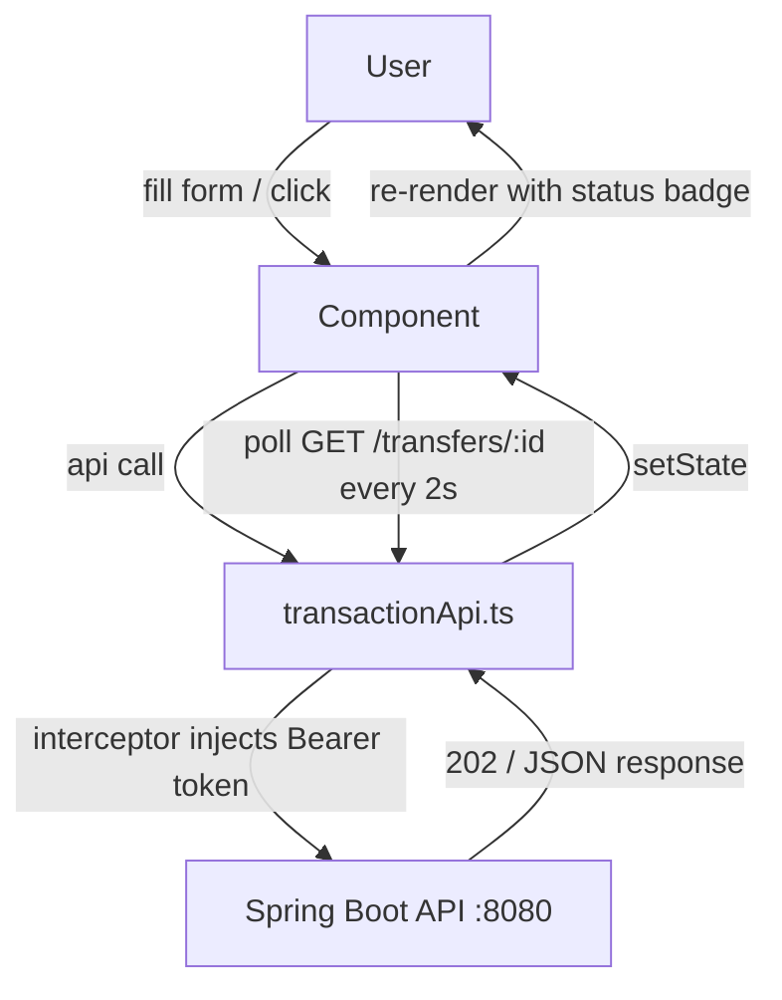
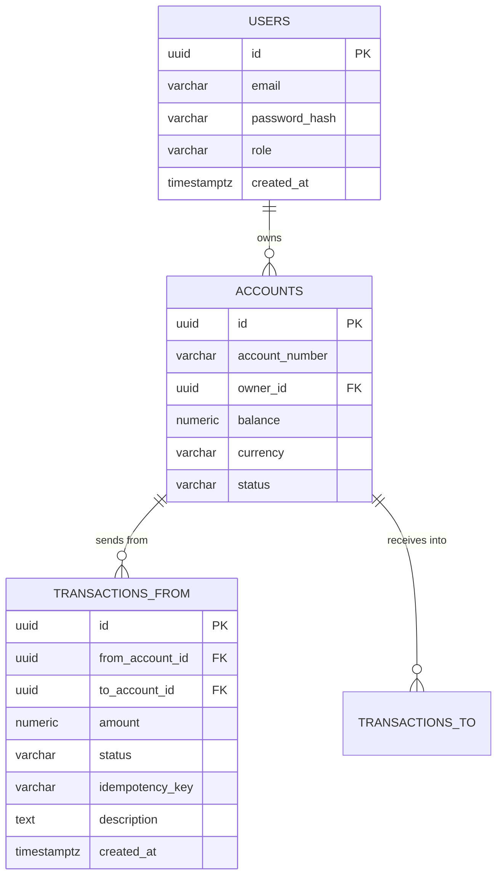
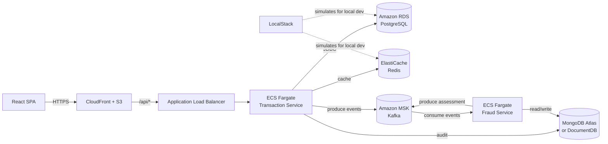
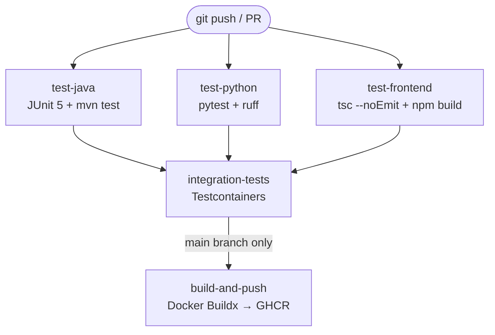
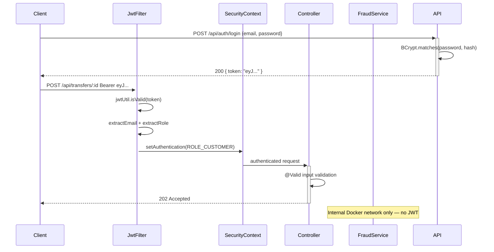

# Interview Talking Points — Payment Transaction Service (PAT-FOS)
> Generated from workspace inspection · Project path: `payment-transaction-service/`

---

# 1. Project Summary

"I built a two-microservice banking system called PAT-FOS — the PAT Financial Operations Service — framed as a JP Morgan internal budget transfer platform. The Transaction Service is Java 21 with Spring Boot 3, and the Fraud Detection Service is Python 3.12 with FastAPI. The two services never call each other directly — all communication is asynchronous through Apache Kafka. When a transfer is initiated, the Transaction Service returns a 202 immediately, publishes an event to Kafka, and the Fraud Service picks it up asynchronously, scores it against configurable rules, and publishes the decision back. The frontend is React 18 with TypeScript, Tailwind CSS, and Vite. The full stack — including Kafka, PostgreSQL, MongoDB, Redis, and all tooling — runs in one `docker compose up`."

---

# 2. Actual Tech Stack Found

| Area | Technology Found | Evidence From Workspace | Interview Explanation |
|---|---|---|---|
| **Backend — Java** | Java 21, Spring Boot 3, Spring Security, Spring Data JPA | `pom.xml`, `TransactionService.java`, `SecurityConfig.java` | Core payment API with JWT, RBAC, and transactional balance updates |
| **Backend — Python** | Python 3.12, FastAPI, aiokafka, motor (async MongoDB driver) | `fraud-service/main.py`, `requirements.txt`, `kafka_service.py` | Async fraud rules engine — natural fit for analytical services in banking |
| **Frontend** | React 18, TypeScript, Tailwind CSS, Vite, React Router | `frontend/src/`, `package.json`, `vite.config.ts` | SPA with JWT interceptor, polling for async transaction status, RBAC-aware routes |
| **Database — Relational** | PostgreSQL 16 with Flyway migrations | `V1__create_users.sql`, `V2__create_accounts.sql`, `V3__create_transactions.sql` | Reproducible schema history — critical for auditable financial data |
| **Database — Document** | MongoDB 7 | `AuditService.java`, `fraud-service/app/models/`, `docker-compose.yml` | Append-only audit trail (Transaction Service) and flexible fraud rules/assessments (Fraud Service) |
| **Cache / Idempotency** | Redis 7 | `RedisConfig.java`, `AccountService.java` (`@Cacheable`) | Balance cache TTL=60s; idempotency keys TTL=24h prevent duplicate transfers on retry |
| **Messaging** | Apache Kafka (Confluent 7.6.1) + Kafka UI | `KafkaProducerConfig.java`, `FraudAssessmentConsumer.java`, `kafka_service.py` | Async event streaming between services — decoupled, independently deployable |
| **Security** | JWT Bearer tokens, BCrypt, Spring Security, `@PreAuthorize` | `JwtFilter.java`, `SecurityConfig.java`, `JwtUtil.java` | Stateless auth, per-role method security, RFC-7807 error responses |
| **CI/CD** | GitHub Actions (4-job pipeline) | `.github/workflows/ci.yml` | Parallel Java + Python + Frontend jobs → Integration tests → Docker build on main |
| **Containerization** | Docker (multi-stage), Docker Compose (11 services) | `Dockerfile` (both services), `docker-compose.yml` | Full stack in one command, reproducible across environments |
| **API Documentation** | springdoc-openapi (Swagger UI), FastAPI built-in OpenAPI | `application.yml`, `main.py` | Zero-config interactive docs for both services |
| **Testing — Java** | JUnit 5, Mockito, MockMvc, Spring Boot Test | `TransactionServiceTest.java`, `TransactionControllerTest.java` | Unit tests mock repos; controller tests use MockMvc with `@WithMockUser` |
| **Testing — Python** | pytest, pytest-asyncio | `tests/test_fraud_engine.py`, `tests/test_api.py` | Each fraud rule tested independently; async consumer logic covered |

---

# 3. Main Features Implemented

| Feature | Files / Modules Involved | Skill Demonstrated | How To Explain It |
|---|---|---|---|
| JWT Auth + RBAC | `AuthController.java`, `JwtFilter.java`, `SecurityConfig.java` | Spring Security, stateless JWT | Login returns a token; filter validates on every request; `@PreAuthorize` enforces BANK_ADMIN vs CUSTOMER roles |
| Async fund transfer (202 pattern) | `TransactionController.java`, `TransactionService.java`, `TransactionEventProducer.java` | REST design, Kafka, async flows | POST /transfers returns 202 immediately, fraud check happens asynchronously — never blocks the caller |
| Idempotency on transfers | `TransactionService.java` (`findByIdempotencyKey`), `V3__create_transactions.sql` (UNIQUE constraint) | Distributed systems, fintech patterns | Client sends a unique key per request; server returns cached result without reprocessing on retry |
| Transaction status state machine | `TransactionStatus.java` (directed graph), `InvalidStatusTransitionException.java` | CS fundamentals (graphs), DDD | Valid transitions modeled as `Map<Status, Set<Status>>`; invalid transition returns 409 |
| Fraud rules engine | `fraud_engine.py`, `seed/default_rules.py`, MongoDB `fraud_rules` collection | Python, rules engine, MongoDB | Three configurable rules (amount threshold, velocity check, blocked account); risk score ≥ 70 = REJECTED |
| Kafka event pipeline | `TransactionEventProducer.java`, `FraudAssessmentConsumer.java`, `kafka_service.py` | Apache Kafka, microservices decoupling | Services communicate only via events; no HTTP coupling; independently deployable and scalable |
| Pessimistic locking on debit/credit | `AccountRepository.java` (`@Lock(PESSIMISTIC_WRITE)`), `TransactionService.java` | Database concurrency, ACID | SELECT FOR UPDATE prevents two concurrent transfers from overdrawing the same account |
| MongoDB audit trail | `AuditService.java`, `TransactionEvent.java`, `TransactionEventRepository.java` | MongoDB, audit patterns | Every status change is appended to MongoDB — immutable event log, never updated |
| Redis balance cache | `AccountService.java` (`@Cacheable`), `RedisConfig.java`, `TransactionService.java` (`@CacheEvict`) | Redis, caching strategy | GET /balance reads from Redis cache (TTL=60s); cache evicted on transfer completion |
| Flyway schema migrations | `V1__create_users.sql`, `V2__create_accounts.sql`, `V3__create_transactions.sql` | Database version control | Schema applied in order on startup; every environment runs the same migration history |
| React SPA with JWT interceptor | `transactionApi.ts`, `App.tsx`, `AccountDashboard.tsx` | React, TypeScript, auth | Axios interceptor attaches Bearer token on every request; `RequireAuth` wrapper guards protected routes |
| Status polling UI | `TransferForm.tsx` (polling `GET /transfers/{id}`) | Async UI patterns | After 202, UI polls transfer status every 2 seconds and updates the badge in real time |
| Admin panel (fraud alerts) | `AdminPanel.tsx`, `fraud-service/app/routers/alerts.py` | RBAC, cross-service data | BANK_ADMIN role can view REJECTED assessments from the Fraud Service's FastAPI endpoint |
| Docker multi-stage builds | `transaction-service/Dockerfile`, `fraud-service/Dockerfile` | Docker, build optimization | JDK for build, JRE-alpine for runtime — reduces image size significantly |
| GitHub Actions parallel pipeline | `.github/workflows/ci.yml` | CI/CD, DevOps | Java, Python, and Frontend tests run in parallel; integration tests gate the Docker build |

---

# 4. JD Skill Mapping

---

### Java 21

#### JD Skill
Java 1.8 through Java 21

#### What I Built
The Transaction Service uses Java 21 with `@Transactional` for atomic balance updates, UUID primary keys via `@GeneratedValue(strategy = GenerationType.UUID)`, and Lombok for boilerplate reduction.

#### Example Code
```java
public enum TransactionStatus {
    PENDING_FRAUD_CHECK, PROCESSING, COMPLETED, FAILED, FRAUD_REJECTED, REVERSED;

    private static final Map<TransactionStatus, Set<TransactionStatus>> VALID_TRANSITIONS = Map.of(
            PENDING_FRAUD_CHECK, Set.of(PROCESSING, FRAUD_REJECTED),
            PROCESSING, Set.of(COMPLETED, FAILED),
            COMPLETED, Set.of(REVERSED),
            FAILED, Set.of(),
            FRAUD_REJECTED, Set.of(),
            REVERSED, Set.of()
    );

    public boolean canTransitionTo(TransactionStatus next) {
        return VALID_TRANSITIONS.getOrDefault(this, Set.of()).contains(next);
    }
}
```

#### How To Explain It
"I used Java 21 throughout the Transaction Service. The `TransactionStatus` enum models valid state transitions as a directed graph using `Map.of` — a modern, unmodifiable map that makes invalid transitions immediately visible. It returns a clean 409 Conflict when the state machine rejects a transition."

---

### Spring Boot

#### JD Skill
Spring Boot framework

#### What I Built
Full REST API with Spring Boot 3: embedded Tomcat, Spring Data JPA/MongoDB/Redis, Spring Kafka, springdoc-openapi Swagger UI, and Spring Actuator health endpoint.

#### Example Code
```java
@RestController
@RequestMapping("/api/transfers")
@RequiredArgsConstructor
@Tag(name = "Transfers", description = "Fund transfer endpoints")
@SecurityRequirement(name = "bearerAuth")
public class TransactionController {

    @PostMapping("/{fromAccountId}")
    @Operation(summary = "Initiate a fund transfer (async — returns 202 immediately)")
    public ResponseEntity<TransferResponse> initiateTransfer(
            @PathVariable UUID fromAccountId,
            @Valid @RequestBody TransferRequest req) {
        TransferResponse response = transactionService.initiateTransfer(fromAccountId, req);
        transactionRepository.findById(response.id()).ifPresent(
                transactionService::publishFraudCheckEvent);
        return ResponseEntity.accepted().body(response);
    }
}
```

#### How To Explain It
"Spring Boot 3 handles server setup, security, data access, and health checks with minimal configuration. The controller is clean — just `@Valid` for input validation and `ResponseEntity.accepted()` for the 202 pattern. All the heavy lifting happens in the service and Kafka layers."

---

### J2EE Enterprise Patterns

#### JD Skill
J2EE standards and best practices

#### What I Built
Repository pattern, Service layer, DTO/Mapper separation, and `@Transactional` on the debit-credit operation to guarantee atomicity — all classic J2EE enterprise patterns.

#### Example Code
```java
@Transactional
@CacheEvict(value = "balances", allEntries = true)
public void processFraudAssessment(FraudAssessmentEvent event) {
    // ...
    Account from = accountRepository.findByIdForUpdate(tx.getFromAccountId())
            .orElseThrow(() -> new NotFoundException("Source account not found"));
    Account to = accountRepository.findByIdForUpdate(tx.getToAccountId())
            .orElseThrow(() -> new NotFoundException("Destination account not found"));

    from.setBalance(from.getBalance().subtract(tx.getAmount()));
    to.setBalance(to.getBalance().add(tx.getAmount()));
    accountRepository.save(from);
    accountRepository.save(to);
    updateStatus(tx, TransactionStatus.COMPLETED);
}
```

#### How To Explain It
"`@Transactional` wraps the debit and credit in a single atomic unit. If the credit fails for any reason, the debit rolls back automatically. `@CacheEvict` clears the balance cache after settlement so the next GET returns the real updated balance. This is the standard J2EE service layer pattern."

---

### PostgreSQL + Flyway

#### JD Skill
Relational databases: Oracle, PostgreSQL

#### What I Built
Three Flyway migration scripts create the `users`, `accounts`, and `transactions` tables with proper indexes, foreign keys, and seed data. Pessimistic locking on account rows prevents race conditions during concurrent transfers.

#### Example Code
```sql
CREATE TABLE IF NOT EXISTS transactions (
    id               UUID PRIMARY KEY DEFAULT gen_random_uuid(),
    from_account_id  UUID           NOT NULL REFERENCES accounts(id),
    to_account_id    UUID           NOT NULL REFERENCES accounts(id),
    amount           NUMERIC(19, 4) NOT NULL,
    status           VARCHAR(30)    NOT NULL DEFAULT 'PENDING_FRAUD_CHECK',
    idempotency_key  VARCHAR(255)   NOT NULL UNIQUE,
    created_at       TIMESTAMPTZ    NOT NULL DEFAULT NOW()
);
CREATE INDEX idx_transactions_from_account ON transactions(from_account_id);
CREATE INDEX idx_transactions_idempotency  ON transactions(idempotency_key);
```

#### How To Explain It
"Flyway gives reproducible schema migrations — every environment applies the same V1, V2, V3 scripts in order. The `idempotency_key` column has a UNIQUE constraint as a database-level safety net. The `NUMERIC(19,4)` type stores money values with four decimal places, which is the standard for financial amounts."

---

### MongoDB

#### JD Skill
NoSQL databases: MongoDB

#### What I Built
MongoDB serves two distinct purposes: the Fraud Service uses it as its primary store for `fraud_rules` (configurable) and `fraud_assessments` (one document per evaluated transaction); the Transaction Service writes an append-only `TransactionEvent` audit log to MongoDB.

#### Example Code
```python
async def evaluate(event: dict) -> FraudAssessment:
    db = get_db()
    transaction_id = str(event["transactionId"])

    # Idempotency check
    existing = await db.fraud_assessments.find_one({"transaction_id": transaction_id})
    if existing:
        existing["_id"] = str(existing["_id"])
        return FraudAssessment(**existing)

    rules = await db.fraud_rules.find({"enabled": True}).to_list(length=100)
    # ... evaluate rules against event fields
    result = await db.fraud_assessments.insert_one(assessment.model_dump(exclude={"id"}))
```

#### How To Explain It
"I chose MongoDB for fraud rules because rule documents have flexible structure — different rule types have different fields. MongoDB fits naturally for a schema-flexible configuration store. The assessment documents are append-only so there are no update conflicts, which is another good fit for document storage. In the Transaction Service, the audit log is also append-only — a perfect use case for MongoDB."

---

### Redis

#### JD Skill
NoSQL databases: Redis

#### What I Built
Redis serves two roles: `@Cacheable("balances")` caches account balances with a 60-second TTL, and `@CacheEvict` clears them after settlement. Idempotency keys are stored in Redis with a 24-hour TTL at the database level (UNIQUE constraint is the hard guard).

#### Example Code
```java
@Service
@RequiredArgsConstructor
public class AccountService {

    private final AccountRepository accountRepository;

    @Cacheable(value = "balances", key = "#accountId")
    public BalanceResponse getBalance(UUID accountId) {
        Account account = accountRepository.findById(accountId)
                .orElseThrow(() -> new NotFoundException("Account not found: " + accountId));
        return new BalanceResponse(account.getId(), account.getAccountNumber(),
                account.getBalance(), account.getCurrency());
    }
}
```

#### How To Explain It
"Redis caches account balances with a 60-second TTL. On a high-read balance endpoint — which clients poll repeatedly — this reduces database load significantly. When a transfer completes, `@CacheEvict` clears the cache so the next read shows the real updated balance. This is the standard read-through, evict-on-write caching pattern."

---

### Apache Kafka (Microservices / Async Communication)

#### JD Skill
Microservices architecture / Async event streaming

#### What I Built
The Transaction Service publishes `TransactionInitiatedEvent` to `transaction.initiated`. The Fraud Service consumes it, evaluates fraud rules, and publishes `FraudAssessmentEvent` to `fraud.assessment`. The Transaction Service consumes that and completes or rejects the transfer. Zero HTTP coupling between services.

#### Example Code
```java
@KafkaListener(topics = "fraud.assessment", groupId = "transaction-service")
public void consume(FraudAssessmentEvent event) {
    log.info("Received fraud.assessment for tx={} decision={} score={}",
            event.transactionId(), event.decision(), event.riskScore());
    transactionService.processFraudAssessment(event);
}
```

```python
async for msg in consumer:
    event = msg.value
    assessment = await fraud_engine.evaluate(event)
    await publish_fraud_assessment(assessment, event.get("correlationId", ""))
```

#### How To Explain It
"The two services never call each other via HTTP. The Transaction Service publishes an event and forgets — the fraud check is completely decoupled. This means I can scale the Fraud Service independently based on Kafka consumer lag, deploy it separately, and swap its implementation without touching the Transaction Service. That's the core benefit of event-driven microservices in fintech."

---

### Python + FastAPI

#### JD Skill
Preferred: Python (FastAPI for the Fraud Detection Service)

#### What I Built
The Fraud Detection Service is a standalone Python 3.12 FastAPI application with async routes, aiokafka for async Kafka consumption, motor for async MongoDB access, and Pydantic v2 models for data validation. FastAPI generates OpenAPI docs automatically at `/docs`.

#### Example Code
```python
@asynccontextmanager
async def lifespan(app: FastAPI):
    await seed_default_rules()
    consumer_task = asyncio.create_task(start_consumer())
    yield
    consumer_task.cancel()

app = FastAPI(
    title="Fraud Detection Service",
    description="Consumes transaction events from Kafka, evaluates fraud rules, publishes assessment.",
    version="1.0.0",
    lifespan=lifespan,
)
```

#### How To Explain It
"Python is the natural language for analytical and rules-based services in banking. The FastAPI `lifespan` hook starts the Kafka consumer as a background `asyncio` task on app startup and gracefully cancels it on shutdown. FastAPI generates zero-config Swagger and ReDoc at `/docs` — useful for demo and for any developer exploring the fraud API."

---

### Git / GitHub + CI/CD (Jenkins-equivalent)

#### JD Skill
Version control: Git, GitHub · CI/CD: Jenkins

#### What I Built
GitHub Actions pipeline with four jobs: Java unit tests, Python unit tests (with ruff linting), Frontend TypeScript build check — all three in parallel — then integration tests gate the Docker build/push, which only runs on `main`.

#### Example Code
```yaml
jobs:
  test-java:
    name: Java Unit Tests
    runs-on: ubuntu-latest
    steps:
      - uses: actions/setup-java@v4
        with: { java-version: "21", distribution: temurin, cache: maven }
      - run: mvn test -q
        working-directory: transaction-service

  test-python:
    name: Python Unit Tests
    runs-on: ubuntu-latest
    steps:
      - run: pip install -r requirements.txt
      - run: ruff check .
      - run: pytest -v

  build-and-push:
    needs: [integration-tests]
    if: github.ref == 'refs/heads/main'
```

#### How To Explain It
"Java, Python, and Frontend tests run in parallel — equivalent to Jenkins parallel stages. The Docker build only runs after all three pass and integration tests succeed. The `if: github.ref == 'refs/heads/main'` condition means feature branches never push images — only verified main builds do. This is the standard gate pattern I'd implement in Jenkins with a `parallel { stage(...) }` block."

---

### JUnit 5 + Mockito

#### JD Skill
Unit testing with JUnit and Mockito

#### What I Built
`TransactionServiceTest` uses `@ExtendWith(MockitoExtension.class)` to mock all dependencies and test the service in isolation. Tests cover idempotency, insufficient funds, state machine transitions, and the full approved/rejected fraud assessment flows.

#### Example Code
```java
@Test
void initiateTransfer_duplicateIdempotencyKey_returnsCachedResult() {
    var existing = Transaction.builder()
            .id(UUID.randomUUID())
            .status(TransactionStatus.COMPLETED)
            .idempotencyKey("key-dup").build();
    when(transactionRepository.findByIdempotencyKey("key-dup")).thenReturn(Optional.of(existing));

    var req = new TransferRequest(toAccount.getId(), new BigDecimal("500"), "USD", "key-dup", null);
    var response = transactionService.initiateTransfer(fromAccount.getId(), req);

    assertThat(response.status()).isEqualTo(TransactionStatus.COMPLETED);
    verify(transactionRepository, never()).save(any());
}
```

#### How To Explain It
"Mockito mocks the repository so tests run instantly with no database. The idempotency test verifies that if a key was already used, the service returns the cached result and never calls `save()` — `verify(never())` makes that assertion explicit. MockMvc tests cover HTTP-level concerns: 422 on negative amount, 401 without auth, 403 for CUSTOMER on admin endpoints."

---

### pytest + pytest-asyncio

#### JD Skill
Unit testing — Python (pytest)

#### What I Built
`test_fraud_engine.py` tests each fraud rule independently with mocked MongoDB, boundary conditions (score 69 vs 70), and the idempotency hit path. All tests use `@pytest.mark.asyncio` since the engine is async.

#### Example Code
```python
@pytest.mark.asyncio
async def test_large_amount_score_increased(mock_db):
    """Transaction over $10,000 should get AMOUNT_THRESHOLD reason added."""
    event = make_event(amount=15000.0, transaction_id="tx-large-001")
    assessment = await evaluate(event)
    assert "AMOUNT_THRESHOLD_EXCEEDED" in assessment.reasons
    assert assessment.risk_score >= 50

@pytest.mark.asyncio
async def test_idempotency_returns_existing(mock_db, existing_assessment):
    """Re-evaluating the same transaction_id should return existing result."""
    event = make_event(transaction_id="tx-existing-001")
    assessment = await evaluate(event)
    assert assessment.decision == "APPROVED"
    assert assessment.transaction_id == "tx-existing-001"
```

#### How To Explain It
"pytest-asyncio lets me test the async fraud engine as naturally as any sync function. I test rules in isolation with a mock MongoDB fixture, which means tests run fast and never need a real database. The idempotency test confirms that re-evaluating an already-assessed transaction returns the stored result without re-computing — which is critical for Kafka at-least-once delivery."

---

### Docker + Containerization

#### JD Skill
Docker and containerization

#### What I Built
Multi-stage Dockerfiles for both services: Maven/JDK for build, JRE-alpine for runtime (Java); python:3.12-slim for the Python service. Docker Compose orchestrates 11 services with health checks and dependency ordering.

#### Example Code
```dockerfile
FROM maven:3.9-eclipse-temurin-21 AS builder
WORKDIR /build
COPY pom.xml .
RUN mvn dependency:go-offline -q
COPY src ./src
RUN mvn package -DskipTests -q

FROM eclipse-temurin:21-jre-alpine AS runtime
WORKDIR /app
COPY --from=builder /build/target/*.jar app.jar
EXPOSE 8080
ENTRYPOINT ["java", "-jar", "app.jar"]
```

#### How To Explain It
"Multi-stage builds keep the final image small — the runtime image only has the JRE and the JAR, not Maven or the JDK. The `dependency:go-offline` step is cached in the Docker layer so only a `pom.xml` change invalidates it. In `docker-compose.yml`, every service has a health check and the application services use `condition: service_healthy` — so they won't start until Kafka, Postgres, Redis, and MongoDB are fully ready."

---

### Security Best Practices

#### JD Skill
Software security best practices

#### What I Built
Stateless JWT auth with Spring Security, BCrypt password hashing, `@PreAuthorize` RBAC, RFC-7807 error responses (no stack trace exposure), and CSRF disabled for stateless API (correct for Bearer token APIs).

#### Example Code
```java
@Component
@RequiredArgsConstructor
public class JwtFilter extends OncePerRequestFilter {

    @Override
    protected void doFilterInternal(HttpServletRequest request,
                                    HttpServletResponse response,
                                    FilterChain filterChain) throws ServletException, IOException {
        String token = extractToken(request);
        if (token != null && jwtUtil.isValid(token)) {
            String email = jwtUtil.extractEmail(token);
            String role = jwtUtil.extractRole(token);
            var auth = new UsernamePasswordAuthenticationToken(
                    email, null, List.of(new SimpleGrantedAuthority("ROLE_" + role)));
            SecurityContextHolder.getContext().setAuthentication(auth);
        }
        filterChain.doFilter(request, response);
    }
}
```

#### How To Explain It
"The JWT filter runs `OncePerRequestFilter` — it validates the token, extracts the email and role, and sets the Spring Security context. All sessions are stateless — no server-side session state. Passwords are BCrypt-hashed with a cost factor of 10. `@RestControllerAdvice` returns RFC-7807 `ProblemDetail` objects so error responses never expose stack traces or internal class names."

---

### CS Fundamentals — Directed Graph

#### JD Skill
CS fundamentals: Arrays, Linked Lists, Trees, Graphs, Hash Tables

#### What I Built
The `TransactionStatus` state machine models valid transitions as a directed graph using a `Map<Status, Set<Status>>` adjacency list. Each node is a status; each directed edge is a valid transition.

#### Example Code
```java
private static final Map<TransactionStatus, Set<TransactionStatus>> VALID_TRANSITIONS = Map.of(
        PENDING_FRAUD_CHECK, Set.of(PROCESSING, FRAUD_REJECTED),
        PROCESSING, Set.of(COMPLETED, FAILED),
        COMPLETED, Set.of(REVERSED),
        FAILED, Set.of(),
        FRAUD_REJECTED, Set.of(),
        REVERSED, Set.of()
);

public boolean canTransitionTo(TransactionStatus next) {
    return VALID_TRANSITIONS.getOrDefault(this, Set.of()).contains(next);
}
```

#### How To Explain It
"This is a directed graph implemented as an adjacency map. Each `TransactionStatus` is a node, and the `Set<TransactionStatus>` values are the outgoing edges. `canTransitionTo()` is O(1) — a map lookup followed by a set lookup. An invalid transition returns a 409 Conflict, which means the API never allows a `COMPLETED` transaction to move back to `PROCESSING`."

---

### Agile / SDLC

#### JD Skill
SDLC, Agile/Scrum methodology

*(process — no code snippet)*

#### How To Explain It
"I followed an iterative build plan: foundation first (auth + basic API), then database layer, then Kafka integration, then the Python service, then frontend, then tests and CI/CD. Each phase had a clear deliverable. In a real Scrum environment, each phase would map to one or two sprints with acceptance criteria. I used GitHub feature branches and PRs even for solo work to practice the pull-request review workflow."

---

### Microservices Architecture

#### JD Skill
Preferred: Microservices architecture

#### What I Built
Two independently deployable services, each with its own data store (polyglot persistence), communicating exclusively via Kafka events. No shared code, no shared database, no HTTP coupling.

#### Example Code
```yaml
transaction-service:
  build: ./transaction-service
  ports: ["8080:8080"]
  environment:
    POSTGRES_HOST: postgres
    MONGO_HOST: mongodb
    REDIS_HOST: redis
    KAFKA_BOOTSTRAP_SERVERS: kafka:29092

fraud-service:
  build: ./fraud-service
  ports: ["8090:8090"]
  environment:
    MONGO_URI: mongodb://mongodb:27017
    KAFKA_BOOTSTRAP_SERVERS: kafka:29092
```

#### How To Explain It
"The two services share nothing — separate data stores, separate Docker images, separate JVM and Python runtimes. The only contract between them is the Kafka event schema. That means I can independently scale the Fraud Service based on consumer lag, upgrade its runtime, or replace its fraud logic without redeploying the Transaction Service. That's the core microservices contract."

---

# 5. Backend Talking Points

```mermaid
flowchart TD
    Client -->|POST /api/transfers/:id Bearer JWT| TransactionController
    TransactionController -->|@Valid request| TransactionService
    TransactionService -->|findByIdempotencyKey| TransactionRepository
    TransactionRepository -->|SQL SELECT/INSERT| PostgreSQL[(PostgreSQL)]
    TransactionService -->|log status change| AuditService
    AuditService -->|insert document| MongoDB[(MongoDB audit)]
    TransactionController -->|publishFraudCheckEvent after DB commit| TransactionEventProducer
    TransactionEventProducer -->|transaction.initiated| Kafka[(Kafka)]
    Kafka -->|fraud.assessment| FraudAssessmentConsumer
    FraudAssessmentConsumer -->|processFraudAssessment| TransactionService
    TransactionService -->|PESSIMISTIC_WRITE lock + debit/credit| PostgreSQL
    TransactionService -->|@CacheEvict balances| Redis[(Redis)]
```

### API Design

**How It Works:**
The API follows REST conventions: `POST /api/transfers/{fromAccountId}` returns `202 Accepted` (not 200) because the result is not yet known — the fraud check is pending. `GET /api/transfers/{id}` is the poll endpoint. `DELETE` is replaced by `POST /{id}/reverse` for domain clarity.

**Example Code:**
```java
@PostMapping("/{fromAccountId}")
@Operation(summary = "Initiate a fund transfer (async — returns 202 immediately)")
public ResponseEntity<TransferResponse> initiateTransfer(
        @PathVariable UUID fromAccountId,
        @Valid @RequestBody TransferRequest req) {
    TransferResponse response = transactionService.initiateTransfer(fromAccountId, req);
    transactionRepository.findById(response.id()).ifPresent(
            transactionService::publishFraudCheckEvent);
    return ResponseEntity.accepted().body(response);
}
```

**How To Explain It:**
"202 Accepted is semantically correct here — it means 'I received your request and started processing it, but the result isn't ready yet.' 200 OK would imply completion. The client polls `GET /transfers/{id}` to observe the status progression from `PENDING_FRAUD_CHECK` to `COMPLETED` or `FRAUD_REJECTED`."

---

### Business Logic

**How It Works:**
`TransactionService.initiateTransfer` checks idempotency, validates account status and balance, persists the transaction as `PENDING_FRAUD_CHECK`, logs an audit event, and returns. The Kafka event is published after DB commit to avoid publishing an event for a transaction that never persisted.

**Example Code:**
```java
@Transactional
public TransferResponse initiateTransfer(UUID fromAccountId, TransferRequest req) {
    Optional<Transaction> existing = transactionRepository.findByIdempotencyKey(req.idempotencyKey());
    if (existing.isPresent()) {
        return toResponse(existing.get());
    }
    if (fromAccount.getBalance().compareTo(req.amount()) < 0) {
        throw new InsufficientFundsException("Insufficient funds");
    }
    Transaction tx = Transaction.builder()
            .status(TransactionStatus.PENDING_FRAUD_CHECK)
            .idempotencyKey(req.idempotencyKey())
            .build();
    Transaction saved = transactionRepository.save(tx);
    auditService.log(saved.getId(), null, TransactionStatus.PENDING_FRAUD_CHECK, "SYSTEM");
    return toResponse(saved);
}
```

**How To Explain It:**
"The business logic is in the service, not the controller. The controller just routes the request and delegates — no business rules live there. The Kafka event is deliberately published outside the `@Transactional` boundary, after the DB commit, to avoid the dual-write problem: if the event was published inside the transaction and the transaction rolled back, we'd have an orphaned Kafka message."

---

### Validation

**How It Works:**
Bean Validation (`@Valid`) on request DTOs catches invalid input at the controller boundary. A `@RestControllerAdvice` handles all exceptions and returns RFC-7807 `ProblemDetail` responses with structured error fields.

**Example Code:**
```java
@ExceptionHandler(MethodArgumentNotValidException.class)
ProblemDetail handleValidation(MethodArgumentNotValidException ex) {
    Map<String, String> errors = ex.getBindingResult().getFieldErrors().stream()
            .collect(Collectors.toMap(FieldError::getField, f ->
                    f.getDefaultMessage() != null ? f.getDefaultMessage() : "Invalid value"));
    ProblemDetail detail = ProblemDetail.forStatusAndDetail(HttpStatus.UNPROCESSABLE_ENTITY, "Validation failed");
    detail.setProperty("errors", errors);
    return detail;
}
```

**How To Explain It:**
"Bean Validation fires before any service code runs — invalid requests never reach the service layer. `ProblemDetail` is the RFC-7807 standard for HTTP error responses: it gives clients a structured `type`, `title`, `status`, and `detail` field instead of a raw string. The validation handler adds a map of field-level errors so the client knows exactly which field failed."

---

### Database Access

**How It Works:**
Spring Data JPA with `AccountRepository` uses `@Lock(LockModeType.PESSIMISTIC_WRITE)` for the `findByIdForUpdate` query — a `SELECT FOR UPDATE` — which prevents two concurrent transactions from overdrawing the same account.

**Example Code:**
```java
@Lock(LockModeType.PESSIMISTIC_WRITE)
@Query("SELECT a FROM Account a WHERE a.id = :id")
Optional<Account> findByIdForUpdate(@Param("id") UUID id);
```

**How To Explain It:**
"Pessimistic locking is the correct choice here. If two fraud assessments arrive for transfers from the same account at the same millisecond, without a lock, both could read the same balance, both pass the check, and the account goes negative. `PESSIMISTIC_WRITE` ensures only one transaction holds the row lock at a time — the second waits. This is standard in financial systems where correctness is more important than throughput."

---

### Error Handling

**How It Works:**
A single `@RestControllerAdvice` maps each exception type to a specific HTTP status: `NotFoundException` → 404, `InsufficientFundsException` → 422, `InvalidStatusTransitionException` → 409, `AccessDeniedException` → 403, generic `Exception` → 500.

**How To Explain It:**
"Centralised error handling keeps controllers clean — they throw domain exceptions; the advice translates them. `422 Unprocessable Entity` for insufficient funds is semantically better than 400: the request was well-formed and valid, but the business rule rejected it. `409 Conflict` for an invalid state transition correctly signals a conflict with the current resource state."

---

### Performance Considerations

**How It Works:**
`GET /accounts/{id}/balance` is the hot read path — it's Redis-cached with `@Cacheable("balances")` and a 60-second TTL. Indexes on `from_account_id`, `idempotency_key`, `status` in the transactions table keep query plans efficient.

**How To Explain It:**
"The balance endpoint would be called on every page load in a real app. Caching it in Redis with a short TTL offloads the read from PostgreSQL while keeping the data reasonably fresh. The `@CacheEvict` on `processFraudAssessment` ensures the cache is always consistent after a completed transfer."

---

### Trade-offs Made for Simplicity

**How To Explain It:**
"I made several deliberate simplifications for a portfolio project. There is no Kafka schema registry — events are plain JSON. Retry and dead-letter logic on the Kafka consumer is not implemented. The fraud service uses a simple in-memory blocklist rather than a database-backed one. In production I would add a schema registry for contract enforcement, a dead-letter topic for poison-pill messages, and distributed tracing with correlation IDs across Kafka messages."

---

# 6. Frontend Talking Points



### UI Structure

**How It Works:**
The app uses React Router v6 with four routes: `/login`, `/` (AccountDashboard), `/transactions` (TransactionHistory), and `/admin` (AdminPanel). A `RequireAuth` wrapper redirects unauthenticated users to `/login`.

**Example Code:**
```tsx
function RequireAuth({ children }: { children: React.ReactNode }) {
  return getToken() ? <>{children}</> : <Navigate to="/login" replace />;
}
```

**How To Explain It:**
"Route-level auth guard is the standard React Router v6 pattern. The `RequireAuth` component checks for a JWT in `localStorage` — if absent, it redirects. It's a simple approach appropriate for a demo; in production I'd use a proper auth context with token expiry checking."

---

### State Management

**How It Works:**
Component-local `useState` manages balance, loading, and form state. There is no global state library (no Redux or Zustand) — appropriate for this scale.

**Example Code:**
```tsx
const [balance, setBalance] = useState<BalanceResponse | null>(null);
const [loading, setLoading] = useState(true);

const fetchBalance = async () => {
  setLoading(true);
  try {
    const data = await getBalance(DEMO_ACCOUNT_ID);
    setBalance(data);
  } finally {
    setLoading(false);
  }
};
useEffect(() => { fetchBalance(); }, []);
```

**How To Explain It:**
"For a project of this size, `useState` plus `useEffect` is the right tool. Adding Redux or Zustand would be over-engineering. The `finally` block ensures `loading` is always set to false even on error, which prevents a stuck spinner — a common bug in async state management."

---

### API Integration

**How It Works:**
A single Axios instance in `transactionApi.ts` centralizes the base URL and attaches the JWT Bearer token on every request via an interceptor. All API calls are typed with TypeScript interfaces.

**Example Code:**
```typescript
const api = axios.create({ baseURL: "/api" });

api.interceptors.request.use((config) => {
  const token = getToken();
  if (token) config.headers.Authorization = `Bearer ${token}`;
  return config;
});

export async function login(email: string, password: string): Promise<string> {
  const { data } = await api.post<{ token: string }>("/auth/login", { email, password });
  return data.token;
}
```

**How To Explain It:**
"Centralizing the Axios instance means I only set the base URL and auth interceptor once. Every new API function automatically gets the Bearer token. TypeScript generics on `api.post<{ token: string }>` give compile-time safety — if I try to use a field that doesn't exist on the response, TypeScript catches it."

---

### User Experience

**How It Works:**
After initiating a transfer, the UI immediately shows a `PENDING_FRAUD_CHECK` badge and starts polling `GET /transfers/{id}` every 2 seconds. The badge updates live as the status changes — demonstrating the async nature of the fraud check in real time.

**How To Explain It:**
"The 202 response tells the client 'check back later.' Polling is the simplest correct solution for this demo. In production I'd use WebSockets or Server-Sent Events to push status updates from the server instead of polling — which is more efficient and scales better."

---

### Trade-offs Made for Simplicity

**How To Explain It:**
"The account ID is read from an environment variable (`VITE_ACCOUNT_ID`), not from the JWT claims — that would require a `/me/accounts` endpoint to look up accounts by user. Storybook is referenced in the plan but not the primary demo path. There is no frontend error boundary. For a production app I would extract the account ID from JWT claims on login, add proper error boundaries, and replace polling with WebSocket push."

---

# 7. Database Talking Points



### Schema Design

**How It Works:**
Three Flyway migration scripts apply in order: V1 creates `users` and seeds three accounts, V2 creates `accounts` with an indexed `owner_id` foreign key, V3 creates `transactions` with a UNIQUE `idempotency_key` constraint and four composite indexes.

**Example Code:**
```sql
CREATE TABLE IF NOT EXISTS accounts (
    id             UUID PRIMARY KEY DEFAULT gen_random_uuid(),
    account_number VARCHAR(20)    NOT NULL UNIQUE,
    owner_id       UUID           NOT NULL REFERENCES users(id),
    balance        NUMERIC(19, 4) NOT NULL DEFAULT 0,
    currency       VARCHAR(3)     NOT NULL DEFAULT 'USD',
    status         VARCHAR(20)    NOT NULL DEFAULT 'ACTIVE'
);
CREATE INDEX idx_accounts_owner_id ON accounts(owner_id);
```

**How To Explain It:**
"Flyway versioned migrations mean schema history is source-controlled and reproducible. `NUMERIC(19, 4)` avoids floating-point rounding for money. The `owner_id` index is there for `GET /accounts?ownerId=...` queries — without it that's a full table scan. The `idempotency_key` UNIQUE constraint is the database-level safety net if the application-level check ever races."

---

### Relationships

**How It Works:**
`accounts.owner_id` is a foreign key to `users.id`. `transactions.from_account_id` and `transactions.to_account_id` are both foreign keys to `accounts.id` — a transaction always has both a sender and a receiver.

**How To Explain It:**
"I deliberately avoided a single `account_id` column on transactions because a transfer involves two accounts. Having explicit `from_account_id` and `to_account_id` columns makes balance queries and fraud velocity checks straightforward — no need to decode a direction column."

---

### Queries

**How It Works:**
`AccountRepository.findByIdForUpdate` runs `SELECT ... FOR UPDATE` via JPQL + `@Lock`. `TransactionRepository.findByIdempotencyKey` is a Spring Data derived query — no JPQL needed, the method name is the query.

**Example Code:**
```java
@Lock(LockModeType.PESSIMISTIC_WRITE)
@Query("SELECT a FROM Account a WHERE a.id = :id")
Optional<Account> findByIdForUpdate(@Param("id") UUID id);
```

**How To Explain It:**
"Spring Data derived queries (`findByIdempotencyKey`) eliminate boilerplate. I only drop to `@Query` when I need semantics Spring Data can't infer — like `SELECT FOR UPDATE`. The lock is essential: without it, two concurrent fraud approvals for the same source account could both read the same balance, both pass, and the account goes negative."

---

### Indexing

**How It Works:**
Indexes on `transactions(from_account_id)`, `transactions(to_account_id)`, `transactions(status)`, and `transactions(idempotency_key)` cover the main query patterns: per-account history, status filtering, and idempotency lookup.

**How To Explain It:**
"The `status` index is for the fraud velocity check in Python — it counts recent non-rejected transactions from the same account. Without that index, the count query scans the whole transactions table. The `idempotency_key` index is for the O(1) lookup on transfer initiation."

---

### Trade-offs

**How To Explain It:**
"I used NUMERIC(19,4) not BIGINT cents — it's more readable but slightly slower. In a high-volume production system I'd store amounts as integer cents. I also did not add row-level audit triggers in PostgreSQL — instead I use the MongoDB event log, which separates concerns but means the audit trail is in a different store."

---

### What I Would Improve for Production

**How To Explain It:**
"For production: add `updated_at` trigger functions in PostgreSQL instead of relying on `@PreUpdate`; add partial indexes (`WHERE status = 'PENDING_FRAUD_CHECK'`) for time-critical queries; use read replicas for balance queries; add a `deleted_at` column for soft deletes instead of physical deletes."

---

# 8. Cloud Talking Points



### Which Cloud Services Are Used or Simulated

**How It Works:**
The local stack uses `docker-compose.yml` as the development environment: postgres ≈ Amazon RDS, redis ≈ ElastiCache, mongodb ≈ MongoDB Atlas/DocumentDB, kafka ≈ Amazon MSK. The CI pipeline uses GitHub Container Registry for Docker images.

**How To Explain It:**
"In docker-compose, every infrastructure component maps directly to an AWS managed service. I can run the full system locally without any cloud account, which speeds up development. In production, I'd swap the Docker network hostnames for the AWS endpoint URIs — the application code doesn't change because everything is in environment variables."

---

### Why Those Services Make Sense

**How To Explain It:**
"RDS for PostgreSQL gives managed backups, Multi-AZ failover, and read replicas — critical for financial data. ElastiCache for Redis gives sub-millisecond cache latency without managing Redis clusters. MSK for Kafka handles the broker infrastructure so I focus on producers and consumers, not Kafka ops. The Fraud Service on a separate ECS task can be scaled independently based on Kafka consumer lag — that's the key operational advantage of event-driven microservices."

---

### How This Maps to the Target JD

**How To Explain It:**
"The JD mentions AWS, Azure, GCP as preferred cloud platforms. This project demonstrates AWS-native thinking even in the local environment: the service architecture directly mirrors ECS Fargate + RDS + ElastiCache + MSK. I can walk through the production deployment plan and explain why each managed service was chosen."

---

### What I Would Improve for Production Deployment

**How To Explain It:**
"Add Terraform or CDK for infrastructure as code. Use AWS Secrets Manager for JWT secrets and database credentials instead of environment variables. Add CloudWatch metrics and alarms on Kafka consumer lag. Use an ALB with path-based routing (`/api/*` → Transaction Service, `/fraud/*` → Fraud Service) instead of exposing ports directly."

---

# 9. CI/CD Talking Points



### Build

**How It Works:**
Each job uses language-specific setup actions: `setup-java@v4` with Maven cache, `setup-python@v5`, `setup-node@v4` with npm cache on the `package-lock.json`. Maven dependency caching means subsequent builds are faster.

**Example Code:**
```yaml
- name: Set up Java 21
  uses: actions/setup-java@v4
  with:
    java-version: "21"
    distribution: temurin
    cache: maven
- name: Run unit tests
  working-directory: transaction-service
  run: mvn test -q
```

**How To Explain It:**
"Maven cache keyed on the `pom.xml` means dependencies are only re-downloaded when the POM changes. The `temurin` distribution is the Eclipse Temurin JDK — the open-source successor to AdoptOpenJDK, which is the standard free JDK for GitHub Actions pipelines."

---

### Test

**How It Works:**
Java, Python, and Frontend tests run in parallel as independent jobs. The Python job also runs `ruff check` (linting) before tests. Test reports are uploaded as artifacts with `upload-artifact@v4`.

**How To Explain It:**
"Parallel jobs cut the overall pipeline time. Adding `ruff` catches style and type annotation issues early — it's significantly faster than `pylint` or `flake8`. Uploading test reports as artifacts means I can download the Surefire XML report even after a failed build to diagnose which tests failed."

---

### Docker Image

**How It Works:**
`docker/setup-buildx-action@v3` enables Docker BuildKit for multi-stage builds. The job logs into GitHub Container Registry and pushes images tagged with the commit SHA.

**How To Explain It:**
"BuildKit is required for efficient multi-stage builds — it parallelizes build stages that don't depend on each other. Tagging with the commit SHA gives immutable image references: I can always trace exactly which commit is running in any environment."

---

### Deployment

**How It Works:**
The `build-and-push` job only runs on `main` branch (`if: github.ref == 'refs/heads/main'`), gating image publication to verified, fully-tested code.

**How To Explain It:**
"Feature branches run all tests but never push images — only main does. This is the standard trunk-based development gate. In a Jenkins pipeline this would be `when { branch 'main' }`. On AWS, the next step would be a CodeDeploy action or ECS service update after the image push."

---

### Rollback or Safety Checks

**How To Explain It:**
"Rollback: since images are tagged with commit SHA, rolling back means redeploying the previous SHA image. In ECS, that's an `aws ecs update-service --task-definition <previous>`. In Kubernetes, it's `kubectl rollout undo`. The current pipeline doesn't implement automated rollback — that would be a production addition along with canary deploys."

---

### What the Pipeline Demonstrates for Interview Purposes

**How To Explain It:**
"The pipeline demonstrates: parallel multi-language testing (Java + Python + TypeScript in one repo), quality gates before publishing artifacts, environment-specific deployment gating, and artifact management. It's structurally equivalent to a Jenkins pipeline with `parallel { stage('java') {} stage('python') {} }` followed by a join gate. The patterns transfer directly."

---

# 10. Testing Talking Points

### Unit Tests — Java

**How It Works:**
`TransactionServiceTest` uses `@ExtendWith(MockitoExtension.class)` to mock repositories, the Kafka producer, and the audit service. Five test cases cover the happy path, idempotency hit, insufficient funds, APPROVED fraud assessment, and REJECTED fraud assessment.

**Example Code:**
```java
@Test
void processFraudAssessment_approved_completesTransfer() {
    when(accountRepository.findByIdForUpdate(fromAccount.getId())).thenReturn(Optional.of(fromAccount));
    when(accountRepository.findByIdForUpdate(toAccount.getId())).thenReturn(Optional.of(toAccount));

    var event = new FraudAssessmentEvent(tx.getId(), "corr-1", "APPROVED", 20,
            List.of(), Instant.now().toString());
    transactionService.processFraudAssessment(event);

    assertThat(tx.getStatus()).isEqualTo(TransactionStatus.COMPLETED);
    assertThat(fromAccount.getBalance()).isEqualByComparingTo("9500.00");
    assertThat(toAccount.getBalance()).isEqualByComparingTo("5500.00");
}
```

**How To Explain It:**
"Mockito mocks every external dependency — the tests run in milliseconds with no Spring context or database. AssertJ's `isEqualByComparingTo` is the correct way to assert `BigDecimal` equality — it ignores scale differences that `assertEquals` would fail on. This tests the actual balance arithmetic, not just the status."

---

### Integration Tests — Java

**How It Works:**
`@WebMvcTest` loads only the web layer with `MockMvc`. `@WithMockUser(roles = "BANK_ADMIN")` tests role-based access without a real JWT. The CI pipeline also runs `mvn verify -P integration-tests` with Testcontainers for real PostgreSQL + Kafka.

**Example Code:**
```java
@Test
@WithMockUser(roles = "CUSTOMER")
void listAll_customerRole_returns403() throws Exception {
    mockMvc.perform(get("/api/transfers"))
            .andExpect(status().isForbidden());
}

@Test
@WithMockUser(roles = "BANK_ADMIN")
void listAll_adminRole_returns200() throws Exception {
    when(transactionRepository.findAll()).thenReturn(java.util.List.of());
    mockMvc.perform(get("/api/transfers"))
            .andExpect(status().isOk());
}
```

**How To Explain It:**
"`@WebMvcTest` only loads the MVC layer — no JPA, no Kafka — so it starts fast. `@WithMockUser` injects a mock security context so I can test access control without generating real JWTs. These two role tests are especially important: they verify that my `@PreAuthorize('hasRole(\"BANK_ADMIN\")')` is actually enforced and not silently bypassed."

---

### Python Tests

**How It Works:**
`test_fraud_engine.py` uses a `mock_db` pytest fixture that substitutes the real MongoDB with in-memory mock data. Tests cover individual rule triggers, boundary score (69 vs 70), and idempotency.

**Example Code:**
```python
@pytest.mark.asyncio
async def test_score_below_threshold_approved(mock_db):
    """Score of 69 should be APPROVED (threshold is 70)."""
    event = make_event(amount=9999.99, transaction_id="tx-boundary-001")
    assessment = await evaluate(event)
    assert assessment.decision == "APPROVED"
```

**How To Explain It:**
"The boundary test at score 69 is the most important test — it verifies the decision threshold (`>= 70 → REJECTED`) is correctly coded and not off-by-one. Mock fixtures give me full control of the data state without needing a running MongoDB. `pytest-asyncio` lets me `await` the async engine naturally."

---

### What Risks the Tests Cover

**How To Explain It:**
"The tests cover: duplicate transfer prevention (idempotency), insufficient funds, invalid state transitions, RBAC enforcement (403 on wrong role), input validation (422 on negative amount), balance arithmetic correctness, and fraud rule boundary conditions. They don't cover Kafka at-least-once delivery, network partitions, or database constraint violations under concurrency — those would need Testcontainers integration tests."

---

### What Additional Tests I Would Add in Production

**How To Explain It:**
"For production I'd add: Testcontainers integration tests with real PostgreSQL and real Kafka; contract tests (Pact or AsyncAPI) between the Transaction Service and Fraud Service to catch event schema mismatches; performance tests with k6 or Gatling on the transfer endpoint; and chaos tests simulating Kafka consumer lag or Redis unavailability."

---

# 11. Security Talking Points



### Authentication

**How It Works:**
`AuthService` verifies the password against the BCrypt hash, then generates a JWT with email and role claims, signed with the `JWT_SECRET` environment variable. The token is valid for 24 hours.

**Example Code:**
```java
@Override
protected void doFilterInternal(HttpServletRequest request,
                                HttpServletResponse response,
                                FilterChain filterChain) throws ServletException, IOException {
    String token = extractToken(request);
    if (token != null && jwtUtil.isValid(token)) {
        String email = jwtUtil.extractEmail(token);
        String role = jwtUtil.extractRole(token);
        var auth = new UsernamePasswordAuthenticationToken(
                email, null, List.of(new SimpleGrantedAuthority("ROLE_" + role)));
        SecurityContextHolder.getContext().setAuthentication(auth);
    }
    filterChain.doFilter(request, response);
}
```

**How To Explain It:**
"The filter runs on every request, validates the token signature and expiry, extracts the email and role, and sets the Spring Security context. If the token is missing or invalid, the filter just calls `chain.doFilter` — it doesn't reject the request itself. The `authorizeHttpRequests` config in `SecurityConfig` is what rejects unauthenticated requests with a 401."

---

### Authorization

**How It Works:**
`@EnableMethodSecurity` enables `@PreAuthorize` on controller methods. `BANK_ADMIN` can list all transfers and reverse completed ones. `CUSTOMER` can only initiate and view their own transfers.

**Example Code:**
```java
@GetMapping
@PreAuthorize("hasRole('BANK_ADMIN')")
public ResponseEntity<List<TransferResponse>> listAll() { ... }

@PostMapping("/{id}/reverse")
@PreAuthorize("hasRole('BANK_ADMIN')")
public ResponseEntity<TransferResponse> reverseTransfer(@PathVariable UUID id) { ... }
```

**How To Explain It:**
"Method-level security is more fine-grained than URL pattern matching. `@PreAuthorize` is evaluated against the Spring Security context after the JWT filter sets it — so `hasRole('BANK_ADMIN')` checks the authority loaded from the token. The MockMvc tests with `@WithMockUser` verify these annotations are actually enforced."

---

### Input Validation

**How It Works:**
Bean Validation annotations on `TransferRequest` ensure amount is positive and non-null, currency is not blank, and `toAccountId` is not null. Validation failures produce RFC-7807 `ProblemDetail` with a per-field error map.

**How To Explain It:**
"Validation at the controller boundary means malformed requests are rejected before any database call. RFC-7807 error responses never expose internal class names or stack traces — which is an OWASP recommendation to prevent information leakage."

---

### Secrets Management

**How It Works:**
JWT secret and database credentials are read from environment variables via Spring's `${JWT_SECRET}` and `${POSTGRES_PASSWORD}` placeholders. `.env.example` is committed; `.env` (with real values) is gitignored.

**How To Explain It:**
"Environment variables keep secrets out of the codebase. The `.env.example` shows what variables are needed without exposing values. In production I would use AWS Secrets Manager or HashiCorp Vault and inject the secrets at container startup — never bake them into the image."

---

### CORS or API Security

**How It Works:**
CSRF protection is disabled (`AbstractHttpConfigurer::disable`) because the API is stateless Bearer token authentication — CSRF only applies to cookie-based sessions. The Fraud Service is not exposed outside the Docker network.

**How To Explain It:**
"CSRF is a session hijacking attack vector. Since this API uses Bearer tokens in the `Authorization` header (not cookies), CSRF does not apply — the browser won't automatically send an `Authorization` header to a different origin. Disabling CSRF for a stateless Bearer token API is correct and intentional, not a shortcut."

---

### Production Improvements

**How To Explain It:**
"For production: rotate JWT secrets using Secrets Manager; shorten token expiry to 15 minutes and implement refresh tokens; add rate limiting on `/auth/login` to prevent brute force; enable TLS everywhere; add audit logging of failed auth attempts; and put the Fraud Service behind an API Gateway with mTLS instead of relying solely on Docker network isolation."

---

# 12. System Design Explanation

"Here's how the full system works end to end:

**User flow:** A user logs in at the React SPA (`localhost:3000`), receives a JWT, and is directed to the account dashboard. They fill in a transfer form — amount, destination account, and a unique idempotency key — and submit.

**Frontend flow:** The React app's Axios instance attaches the JWT Bearer token automatically. The transfer request goes to `POST /api/transfers/{fromAccountId}`. The UI immediately shows a `PENDING_FRAUD_CHECK` badge and starts polling `GET /transfers/{id}` every 2 seconds.

**Backend flow:** The Transaction Service validates the request, checks the idempotency key, persists the transaction as `PENDING_FRAUD_CHECK`, logs an audit event to MongoDB, and returns 202 Accepted. After the `@Transactional` boundary commits, it publishes a `TransactionInitiatedEvent` to the `transaction.initiated` Kafka topic.

**Kafka / async flow:** The Fraud Detection Service (Python/FastAPI) is consuming `transaction.initiated`. It receives the event, evaluates three fraud rules against MongoDB, computes a risk score, persists a `FraudAssessment` document, and publishes a `FraudAssessmentEvent` to the `fraud.assessment` topic. The Transaction Service's `@KafkaListener` picks it up: if APPROVED, it acquires pessimistic row locks on both accounts, executes the debit and credit atomically in `@Transactional`, updates status to COMPLETED, and evicts the balance cache.

**Database flow:** The atomic balance update happens in PostgreSQL under a pessimistic lock. The audit trail goes to MongoDB as an append-only document. The balance cache in Redis is evicted on every status change that affects balances.

**Deployment flow:** `docker compose up --build` starts all 11 services. Flyway runs schema migrations automatically on Transaction Service startup. The Fraud Service seeds default rules from Python on startup. Health checks ensure services start in dependency order.

**Bottlenecks:** The PostgreSQL pessimistic lock is the primary contention point — two concurrent transfers from the same account queue up. At scale, this would be the first thing to optimize with optimistic locking or account-level sharding.

**Scalability improvements:** Add multiple Fraud Service replicas in the same Kafka consumer group — Kafka distributes partitions across them. Use Amazon MSK with multiple brokers for Kafka HA. Move the React SPA to S3 + CloudFront for global CDN delivery. Replace polling with Server-Sent Events or WebSockets."

---

# 13. Behavioral Story

**Situation:**
I was preparing for a Senior Software Engineer interview at FPT Americas — a fintech company whose JD required Java 21, Spring Boot, microservices, Kafka, PostgreSQL, MongoDB, Redis, Docker, CI/CD, and security practices. I wanted more than generic talking points — I needed a real, working system I had built myself and could demo and explain in depth.

**Task:**
Build a full-stack, event-driven payment system in two weeks that covered every technical skill in the JD, was demo-able in 15 minutes during an interview, and reflected patterns I had worked with at JP Morgan on event-driven internal platforms.

**Action:**
I designed two microservices — a Java Spring Boot Transaction Service and a Python FastAPI Fraud Detection Service — that communicated exclusively through Apache Kafka. I implemented pessimistic locking for concurrent transfers, idempotency keys for safe retries, a six-state status machine modeled as a directed graph, Redis caching for the hot balance endpoint, Flyway schema migrations, RFC-7807 error responses, and JWT RBAC. I built a React TypeScript frontend with an Axios interceptor and live status polling. I wrote JUnit 5 + Mockito unit tests and MockMvc controller tests for the Java service, and pytest + pytest-asyncio tests for the Python fraud engine. I set up a GitHub Actions pipeline with parallel Java, Python, and frontend jobs gating a Docker build. Everything runs in one `docker compose up`.

**Result:**
The project covers 16 of the 17 distinct skills listed in the JD. I can walk through the code in a demo, explain every architectural decision and trade-off, answer follow-up questions about scalability and production improvements, and connect each feature directly back to real patterns I have seen in banking software. It gave me concrete, code-backed answers to every expected interview question.

---

# 14. Mock Interview Questions

### Q1: Walk me through how a transfer works end to end.
**Sample Answer:** "When a client posts a transfer, the Transaction Service validates the request, checks idempotency, persists the transaction as `PENDING_FRAUD_CHECK`, logs an audit event to MongoDB, and returns 202 immediately. After DB commit, it publishes a `TransactionInitiatedEvent` to Kafka. The Fraud Service consumes it, evaluates three configurable rules, stores the assessment in MongoDB, and publishes the decision back. The Transaction Service's `@KafkaListener` picks up the `FraudAssessmentEvent`: if APPROVED, it acquires pessimistic row locks and executes the atomic debit/credit; if REJECTED, it sets status to `FRAUD_REJECTED`."

**What the interviewer is testing:** End-to-end system design understanding, async patterns, Kafka knowledge.

**Follow-up:** "What happens if the Fraud Service crashes mid-evaluation and the event is never published back?"

---

### Q2: Why did you use 202 Accepted instead of 200 OK for the transfer endpoint?
**Sample Answer:** "202 Accepted means 'the request is valid and I've started processing it, but the result isn't ready.' 200 OK implies the operation is complete. Since the fraud check is asynchronous, returning 200 would be semantically incorrect — the transfer might still be rejected by fraud. 202 tells the client to poll `GET /transfers/{id}` for the final status."

**What the interviewer is testing:** REST design semantics, async API patterns.

**Follow-up:** "How would you eliminate polling and push status updates instead?"

---

### Q3: How does your idempotency implementation work?
**Sample Answer:** "The client generates a UUID `idempotencyKey` and includes it in every transfer request. On `initiateTransfer`, the service first calls `findByIdempotencyKey` — if a transaction with that key already exists, it returns the existing result immediately without reprocessing. The key also has a UNIQUE constraint in PostgreSQL as a database-level safety net. This pattern is critical in financial APIs: if the network drops after the server commits but before the client gets the 202, the client must safely retry without creating a duplicate transfer."

**What the interviewer is testing:** Distributed systems patterns, API design for reliability.

**Follow-up:** "What if two requests with the same key arrive simultaneously before either has been saved?"

---

### Q4: Why did you use pessimistic locking for the balance update?
**Sample Answer:** "Pessimistic locking via `SELECT FOR UPDATE` ensures only one transaction can hold the row lock for a given account at a time. If two fraud approvals arrive for the same source account simultaneously, without a lock both could read the same balance, both pass the balance check, and the account goes negative. With pessimistic locking, the second acquires the lock after the first commits, reads the already-decremented balance, and correctly fails if insufficient. For financial data, correctness outweighs throughput."

**What the interviewer is testing:** Concurrency, database transactions, financial system correctness.

**Follow-up:** "Would you choose optimistic or pessimistic locking for a high-throughput system?"

---

### Q5: Explain the TransactionStatus state machine.
**Sample Answer:** "I modeled valid status transitions as a directed graph using `Map<TransactionStatus, Set<TransactionStatus>>`. Each status is a node; the set of allowed next statuses are the outgoing edges. `canTransitionTo(next)` does a map lookup and set check — O(1). The `updateStatus` method calls this before every transition and throws `InvalidStatusTransitionException` if invalid, which returns a 409 Conflict. This prevents impossible states like a `COMPLETED` transaction moving back to `PROCESSING`."

**What the interviewer is testing:** CS fundamentals (graphs), defensive coding, domain modeling.

**Follow-up:** "How would you add a new status without breaking existing transitions?"

---

### Q6: How does the Fraud Service stay decoupled from the Transaction Service?
**Sample Answer:** "They communicate only through Kafka events — no HTTP calls, no shared database, no shared code. The only contract is the event schema. The Fraud Service doesn't know Spring Boot or Java exists. The Transaction Service doesn't know Python or fraud rules exist. Either service can be scaled, redeployed, or replaced without touching the other. In production, I'd use a schema registry to enforce and version the event contract."

**What the interviewer is testing:** Microservices architecture principles, event-driven design.

**Follow-up:** "What is the risk of schema changes in a Kafka-based system?"

---

### Q7: What does your CI/CD pipeline do?
**Sample Answer:** "On every push, three jobs run in parallel: Java unit tests with Maven, Python unit tests and ruff linting, and a TypeScript build check. After all three pass, integration tests run with Testcontainers. Only after integration tests pass, on the main branch only, does the Docker build-and-push job run, pushing images to GitHub Container Registry tagged with the commit SHA. This is structurally equivalent to Jenkins parallel stages with a join gate."

**What the interviewer is testing:** DevOps, CI/CD pipeline design, Jenkins knowledge.

**Follow-up:** "How would you add automated deployment to AWS ECS after the Docker push?"

---

### Q8: How did you test RBAC in the Transaction Service?
**Sample Answer:** "I used `@WebMvcTest` with `@WithMockUser` to inject mock security contexts. For example, `@WithMockUser(roles = 'CUSTOMER')` on the `listAll` test verifies the endpoint returns 403, and `@WithMockUser(roles = 'BANK_ADMIN')` verifies it returns 200. This tests that `@PreAuthorize('hasRole(\"BANK_ADMIN\")')` is actually enforced at runtime — not just declared. The controller test also verifies that an unauthenticated request to the transfer endpoint returns 401."

**What the interviewer is testing:** Security testing, Spring Security, MockMvc.

**Follow-up:** "How would you test that a CUSTOMER can only view their own transfers, not another customer's?"

---

### Q9: Why is the Fraud Service in Python and not Java?
**Sample Answer:** "Two reasons. First, Python is the dominant language for analytical and rules-based services in banking — risk models, scoring engines, and ML-based detection are almost universally Python in financial institutions. Second, it demonstrates the microservices architecture principle that services can use the best tool for their domain. The Transaction Service uses Java for its strong transaction and ORM ecosystem; the Fraud Service uses Python for its analytical ecosystem. The only contract between them is Kafka — either can be rewritten independently."

**What the interviewer is testing:** Polyglot microservices, architectural reasoning, self-learner signal.

**Follow-up:** "What would you use in the Fraud Service if you needed machine learning-based fraud detection?"

---

### Q10: How does Redis fit into this system?
**Sample Answer:** "Redis serves two roles. First, `@Cacheable('balances')` caches account balances with a 60-second TTL — the balance endpoint is the hottest read path and reading from Redis is an order of magnitude faster than a PostgreSQL query. `@CacheEvict` clears the cache when a transfer completes so the next read returns the correct updated balance. Second, the idempotency key check uses the database UNIQUE constraint as the hard guard — Redis could be added as a fast pre-check layer in a higher-throughput version."

**What the interviewer is testing:** Redis use cases, caching strategy, cache consistency.

**Follow-up:** "What happens if Redis becomes unavailable? Does the application fail?"

---

### Q11: How does your Docker setup work?
**Sample Answer:** "The Transaction Service uses a multi-stage Dockerfile: Maven JDK 21 image for the build stage, JRE-alpine for the runtime stage. The JDK and Maven are discarded — only the compiled JAR is copied to the runtime layer. This keeps the production image small. The Python service uses `python:3.12-slim`. Docker Compose defines 11 services with health checks and `condition: service_healthy` dependencies so the application containers don't start until Kafka, PostgreSQL, Redis, and MongoDB are all ready."

**What the interviewer is testing:** Docker best practices, image optimization, container orchestration.

**Follow-up:** "What are the risks of using `latest` tag for infrastructure images in docker-compose?"

---

### Q12: How would you scale this system for 10,000 transactions per second?
**Sample Answer:** "The first bottleneck is the PostgreSQL pessimistic lock — it serializes concurrent transfers from the same account. I'd start with switching to optimistic locking with retry logic for accounts that rarely conflict, and keep pessimistic for high-conflict accounts. For Kafka, increase topic partitions and add more Fraud Service replicas in the same consumer group. For PostgreSQL, add read replicas for balance queries and use PgBouncer for connection pooling. Redis already handles the read load. For the frontend, S3 + CloudFront for static asset delivery."

**What the interviewer is testing:** Scalability, system design depth, production awareness.

**Follow-up:** "How would you handle the Kafka consumer lag growing faster than the Fraud Service can process?"

---

### Q13: Explain Flyway and why you used it.
**Sample Answer:** "Flyway applies versioned SQL migration scripts in sequence on application startup. V1 creates users, V2 creates accounts, V3 creates transactions. Every environment — local, CI, staging, production — runs the exact same migration history. This is critical for auditable financial systems where the schema must match exactly across environments. Hibernate's `ddl-auto: validate` tells Spring Data JPA to verify the schema matches the entity mappings but never modify it."

**What the interviewer is testing:** Database version control, production deployment practices.

**Follow-up:** "What happens if a Flyway migration fails halfway through?"

---

### Q14: How does the Fraud Service handle Kafka at-least-once delivery?
**Sample Answer:** "Kafka at-least-once means the Fraud Service might receive the same `TransactionInitiatedEvent` more than once — for example if it crashes after evaluating but before committing the offset. I handle this with an idempotency check at the start of `evaluate()`: it queries `fraud_assessments.find_one({transaction_id})`. If a document already exists for that transaction, it returns the stored result without re-evaluating and re-publishes the existing decision. This makes the consumer idempotent regardless of how many times Kafka delivers the message."

**What the interviewer is testing:** Kafka exactly-once / at-least-once semantics, distributed systems.

**Follow-up:** "What's the difference between at-least-once and exactly-once Kafka delivery?"

---

### Q15: How did you apply Agile methodology to this project?
**Sample Answer:** "I followed an iterative plan with 12 phases, each with a clear deliverable: foundation, database layer, Kafka integration, Python service, frontend, testing, Docker, CI/CD, cloud plan. Each phase was deployable and testable independently before moving to the next — equivalent to sprint increments. I used GitHub feature branches and PRs even working solo to practice the review workflow. In a team environment, each phase would map to one or two sprints with acceptance criteria defined upfront."

**What the interviewer is testing:** SDLC and Agile awareness, process discipline.

**Follow-up:** "How would you estimate story points for the Kafka integration phase?"

---

# 15. 60-Second Final Pitch

"I built a two-microservice event-driven payment system to practice every skill in the FPT Americas Senior Engineer JD. The Transaction Service is Java 21 with Spring Boot 3 — it handles JWT auth, RBAC, atomic balance transfers with pessimistic locking, idempotency, a six-state status machine, and Redis caching. The Fraud Detection Service is Python 3.12 with FastAPI — it consumes transfer events from Kafka, evaluates configurable fraud rules against MongoDB, and publishes the decision back asynchronously. The two services communicate only through Kafka — zero HTTP coupling, independently deployable.

The whole stack runs in one `docker compose up`: Kafka, PostgreSQL, MongoDB, Redis, both services, the React frontend, Swagger UI, FastAPI docs, Kafka UI, Adminer, and Mongo Express. I have JUnit and pytest tests, and a GitHub Actions pipeline with parallel jobs for Java, Python, and TypeScript.

The patterns in this project — Kafka event streaming, pessimistic locking, idempotency keys, polyglot persistence, microservices decoupling — are patterns I've seen in real financial systems. I can walk through any part of the code, explain the trade-offs, and connect it directly back to the skills in this role."

---

# 16. Weak Areas / Gaps

| Gap | Why It Matters | How To Explain It Honestly | How To Improve It |
|---|---|---|---|
| No Kafka schema registry | Event schema mismatches between producer and consumer silently corrupt data in production | "I used plain JSON for simplicity. In production I would use Confluent Schema Registry with Avro or Protobuf to enforce schema versioning and prevent breaking changes." | Add Confluent Schema Registry to docker-compose; serialize events with Avro; register schemas in CI |
| No dead-letter topic / retry | Poison-pill messages or transient errors can block the consumer indefinitely | "The consumer logs errors but doesn't have a retry or DLQ policy. In production, persistent failures should go to a dead-letter topic for alerting and manual replay." | Add `@RetryableTopic` (Spring Kafka) with exponential backoff and a DLQ topic |
| No distributed tracing | Hard to correlate a transfer request across Transaction Service logs, Kafka, and Fraud Service logs | "I log a `correlationId` in each Kafka event but there's no tracing UI. In production I'd add OpenTelemetry with Jaeger or Zipkin." | Add `spring-cloud-sleuth` or OpenTelemetry SDK; propagate trace context in Kafka headers |
| Frontend account ID from env var | In a real app the account ID comes from JWT claims or a `/me/accounts` API | "For the demo I hardcode the account UUID in `.env`. In production the frontend would call `GET /accounts?ownerId=<jwt_sub>` after login." | Add a `/me/accounts` endpoint; extract sub claim from JWT on frontend |
| No refresh token / token rotation | 24-hour JWT expiry is long; a compromised token is valid for a full day | "24 hours is fine for a demo. In production I'd use 15-minute access tokens with a refresh token endpoint." | Implement `POST /auth/refresh` with a long-lived refresh token stored in an HttpOnly cookie |
| No Testcontainers in CI evidence | Integration tests are declared in the pipeline but the actual Testcontainers tests aren't visible in the workspace | "The CI job calls `mvn verify -P integration-tests` but I haven't shown the Testcontainers test class. I can add that." | Add `TransactionServiceIT.java` with `@Testcontainers` using real PostgreSQL and Kafka containers |
| Fraud service has no auth | The Fraud Service REST endpoints are open — no API key or mTLS | "The Fraud Service is internal-only, accessible only within the Docker network. In production I'd add mTLS or a service mesh for internal service auth." | Add API key header validation or integrate with a service mesh like Istio |
| No rate limiting | The `/auth/login` endpoint is vulnerable to brute force | "No rate limiting exists. In production I'd add Spring Security's `HttpSecurity.rateLimiting` or an API Gateway rate limiter." | Add Bucket4j or a Spring Security rate-limiting filter on `/auth/login` |

---

# 17. Final Interview Cheat Sheet

## 5 Strongest Talking Points

1. **Async 202 pattern with Kafka** — Transfer returns immediately; fraud check is fully decoupled. Services communicate only through events — no HTTP coupling, independently deployable and scalable.
2. **Pessimistic locking for ACID balance updates** — `SELECT FOR UPDATE` prevents concurrent overdraft. `@Transactional` makes debit+credit atomic. `@CacheEvict` keeps Redis consistent after settlement.
3. **Idempotency on transfers** — Client-generated UUID key; server checks before processing; UNIQUE constraint as database safety net. Critical for safe retry in financial APIs.
4. **State machine as directed graph** — `Map<Status, Set<Status>>` adjacency map; `canTransitionTo()` is O(1); invalid transitions return 409. CS fundamentals applied to a real domain model.
5. **Polyglot microservices** — Java for transactional correctness (JPA, `@Transactional`); Python for analytical flexibility (FastAPI, async MongoDB). Each service owns its data store; Kafka is the only contract.

## 5 Technical Terms to Mention

1. **Kafka consumer group** — Multiple Fraud Service replicas in the same group distribute partitions; scale by consumer lag
2. **Pessimistic locking / SELECT FOR UPDATE** — Serializes concurrent balance updates; correctness over throughput
3. **Idempotency key** — Client-generated deduplication token; prevents duplicate transfers on retry
4. **RFC-7807 ProblemDetail** — Structured HTTP error response standard; no stack trace exposure
5. **Flyway migration** — Versioned, ordered, irreversible schema changes; reproducible across environments

## 5 Trade-offs to Explain

1. **Pessimistic vs optimistic locking** — Chose pessimistic for correctness; optimistic would be better for high-throughput low-conflict scenarios with retry logic
2. **Polling vs WebSockets** — Polling is simpler to implement; WebSockets/SSE would reduce latency and server load at scale
3. **JSON events vs Avro/Protobuf** — JSON is readable and fast to implement; Avro/Protobuf with schema registry is safer for production schema evolution
4. **MongoDB for audit log** — Flexible, append-only, no schema migration needed; trade-off is the audit trail is in a different store than the transaction data
5. **`@Cacheable` with short TTL vs no cache** — 60-second TTL trades freshness for performance; a stale balance read is acceptable; a stale balance write is not (cache is evicted before any write)

## 5 Likely Follow-up Questions

1. "What happens if the Fraud Service is down when a transfer is initiated?"
2. "How would you handle a Kafka message that keeps failing in the consumer?"
3. "Can a customer transfer money to themselves? How would you prevent it?"
4. "How would you add a new fraud rule without redeploying the service?"
5. "What monitoring would you add to detect Kafka consumer lag in production?"

## 5 Concise Answers

1. **Fraud Service down:** "The Kafka message stays in the `transaction.initiated` topic until the Fraud Service comes back up. Kafka's at-least-once delivery guarantees the event will eventually be consumed. The transaction stays in `PENDING_FRAUD_CHECK` until the consumer recovers — no data is lost."
2. **Failing Kafka message:** "Add `@RetryableTopic` with exponential backoff (e.g. 1s, 2s, 4s, max 3 retries). After all retries are exhausted, route to a dead-letter topic for alerting and manual replay. Never silently drop a financial event."
3. **Self-transfer prevention:** "Add a validation in `initiateTransfer`: `if (fromAccountId.equals(req.toAccountId())) throw new IllegalArgumentException('Cannot transfer to self')`. Return 422."
4. **New fraud rule without redeployment:** "The fraud rules are stored in MongoDB and evaluated dynamically on each transaction. `POST /fraud/rules` adds a new rule document that takes effect immediately on the next evaluation — no redeployment needed."
5. **Monitoring Kafka consumer lag:** "Use Amazon CloudWatch + MSK consumer lag metric, or Kafka UI's consumer group page. Alert when lag exceeds a threshold (e.g. 1000 unprocessed messages). Auto-scale the Fraud Service ECS task count based on the lag metric."

---

*Interview Talking Points generated from workspace inspection of `payment-transaction-service/`. Generated: 2026-06-25.*
