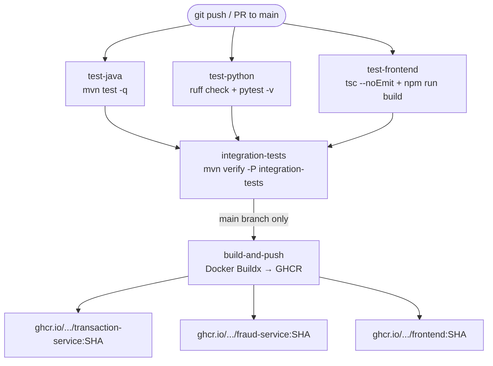

# New Hire Exploration Guide — PAT-FOS (Payment Transaction Service)

> **Project path:** `payment-transaction-service/`
> **Last updated:** 2026-06-25

---

## 0. What Is This Project?

PAT-FOS (PAT Financial Operations Service) is a full-stack, event-driven payment processing system framed as a JP Morgan internal budget transfer platform. It lets users initiate fund transfers between accounts; instead of processing the transfer immediately, it sends the request to a separate fraud detection engine that evaluates the transaction asynchronously and decides whether to approve or reject it. The two services — a Java payment API and a Python fraud analysis service — never talk to each other directly; they communicate only through Apache Kafka, which means either service can be scaled, updated, or replaced independently. The entire system — including message broker, databases, and admin UIs — runs locally in Docker with a single command.

---

## 1. Quick Start (Everything Up in One Command)

### Prerequisites

| Tool | Minimum version | Check |
|---|---|---|
| Docker Desktop | 24+ | `docker --version` |
| Docker Compose | v2.20+ | `docker compose version` |

No local Java, Python, or Node.js installation needed — everything runs inside Docker.

### Start the stack

```bash
# 1. Clone the repository
git clone <your-repo-url>
cd payment-transaction-service

# 2. Create your local environment file (defaults work out of the box)
cp .env.example .env

# 3. Build all images and start all services
docker compose up --build
```

> **First run takes ~3–5 minutes** — Maven downloads ~200 MB of dependencies. Subsequent starts take under 30 seconds.

Watch for this line before testing:
```
transaction-service-1  | Started PaymentTransactionApplication in X.XXX seconds
```

### Common commands after first build

```bash
docker compose up -d            # start in background
docker compose down             # stop (data volumes preserved)
docker compose down -v          # stop AND wipe all data (clean slate)
docker compose logs -f          # stream all logs
docker compose logs -f transaction-service   # stream one service
docker compose logs -f fraud-service
```

### Service Map

| Service | URL | What You Will See |
|---|---|---|
| **Frontend** (React SPA) | http://localhost:3000 | Login page → account dashboard with balance and transfer form |
| **Transaction Service** (Spring Boot API) | http://localhost:8080 | JSON API responses |
| **Swagger UI** (Transaction Service docs) | http://localhost:8080/swagger-ui.html | Interactive REST API explorer with JWT auth |
| **Fraud Service** (FastAPI) | http://localhost:8090 | JSON API responses |
| **FastAPI Docs** (Fraud Service docs) | http://localhost:8090/docs | Auto-generated OpenAPI docs with live Try-It-Out |
| **Kafka UI** | http://localhost:8082 | Topic browser, message inspector, consumer group lag |
| **Adminer** (PostgreSQL UI) | http://localhost:8888 | Browse users, accounts, transactions tables |
| **Mongo Express** (MongoDB UI) | http://localhost:8081 | Browse fraud_rules, fraud_assessments, transaction_events |

---

## 2. Explore the Frontend

### Landing page

Open http://localhost:3000 — you'll see a clean login form.

### Demo accounts (seeded automatically by Flyway)

| Role | Email | Password | What they can do |
|---|---|---|---|
| `CUSTOMER` | `alice@example.com` | `customer123` | Initiate transfers from ACC-ALICE-001 (balance: $50,000) |
| `CUSTOMER` | `bob@example.com` | `customer123` | Initiate transfers from ACC-BOB-001 (balance: $20,000) |
| `BANK_ADMIN` | `admin@bank.com` | `admin123` | View all transactions, reverse completed transfers |

### Key flows to walk through

**1. Account Dashboard (`/`)**
After logging in as Alice, you'll see her balance card and a "New Transfer" button. Notice the balance is served from Redis cache (TTL: 60 seconds). Click "History" to navigate to transaction history.

**2. Transfer Form (on Dashboard)**
Click "New Transfer". Enter Bob's account UUID (find it from Adminer after login — look at the `accounts` table and copy `ACC-BOB-001`'s `id` column). Enter an amount under $10,000 (e.g., $500) to get an APPROVED result. Watch the status badge change from `PENDING FRAUD CHECK` → `COMPLETED` in real time as the UI polls every 2 seconds.

**3. Fraud rejection flow**
Try a transfer of $15,000. The status badge will cycle through `PENDING FRAUD CHECK` → `FRAUD REJECTED` because $15,000 exceeds the $10,000 fraud threshold. The balance will not change.

**4. Transaction History (`/transactions`)**
View all your past transfers with color-coded status badges: yellow = pending, blue = processing, green = completed, red = failed/rejected, gray = reversed.

**5. Admin Panel (`/admin`) — log in as admin first**
Log out (top right), log in as `admin@bank.com`. Navigate to http://localhost:3000/admin. You'll see every transfer across all accounts. Find a COMPLETED transaction and click "Reverse" to see the reversal flow.

### Frontend source code structure

```
frontend/src/
├── api/
│   └── transactionApi.ts     ← All API calls + Axios interceptor (JWT injection)
├── pages/
│   ├── LoginPage.tsx          ← Login form
│   ├── AccountDashboard.tsx   ← Balance card + transfer form
│   ├── TransactionHistory.tsx ← Per-account transaction list
│   └── AdminPanel.tsx         ← BANK_ADMIN view, all transactions + reverse
├── components/
│   ├── TransferForm.tsx        ← Transfer submission with idempotency key (uuid v4)
│   ├── StatusBadge.tsx         ← Color-coded status pill component
│   ├── BalanceCard.tsx         ← Balance display card
│   └── TransactionRow.tsx      ← Single row in transaction table
└── App.tsx                    ← Routes + RequireAuth guard
```

### Storybook

The `package.json` includes `"storybook": "storybook dev -p 6006"`. To run it:
```bash
cd frontend
npm install
npm run storybook
```
Then open http://localhost:6006. (No `.storybook/` config has been committed yet — this is a declared future step in the plan.)

---

## 3. Explore the Backend API

### Transaction Service — Swagger UI

Open http://localhost:8080/swagger-ui.html

You'll see three tag groups: **Auth**, **Accounts**, and **Transfers**.

#### Step 1: Get a JWT token

1. Expand **Auth → POST /api/auth/login**
2. Click "Try it out"
3. Enter:
   ```json
   { "email": "alice@example.com", "password": "customer123" }
   ```
4. Execute — copy the `token` value from the response
5. Click the **Authorize 🔒** button at the top right
6. Paste `<token>` (without quotes) into the **bearerAuth** field → Authorize

#### Step 2: Try these endpoints in order

| # | Endpoint | What to send | What to observe |
|---|---|---|---|
| 1 | `GET /api/accounts/{id}/balance` | Alice's account UUID (from Adminer) | Balance from Redis cache; check Adminer to confirm it matches |
| 2 | `GET /api/accounts/{id}/transactions` | Same account UUID | Empty list at first, grows after each transfer |
| 3 | `POST /api/transfers/{fromAccountId}` | Alice's account ID in path; see body below | Returns `202 Accepted` immediately with status `PENDING_FRAUD_CHECK` |
| 4 | `GET /api/transfers/{id}` | Transaction ID from step 3 | Poll this; watch status change to COMPLETED |
| 5 | `GET /api/transfers` (as BANK_ADMIN) | Re-authorize with admin token | Lists all transfers; returns 403 if you try with Alice's token |
| 6 | `POST /api/transfers/{id}/reverse` | A COMPLETED transfer ID | Changes status to REVERSED; observe balance change in Adminer |

**Transfer request body for step 3:**
```json
{
  "toAccountId": "<bob-account-uuid>",
  "amount": 500.00,
  "currency": "USD",
  "idempotencyKey": "my-unique-key-001",
  "description": "Test transfer"
}
```

> **Idempotency experiment:** Send the exact same request twice with the same `idempotencyKey`. The second call returns the same result without creating a duplicate transaction — verify in Adminer.

#### Controller source code locations

```
transaction-service/src/main/java/com/fpt/payments/controller/
├── AuthController.java        ← POST /api/auth/login, /register
├── AccountController.java     ← GET /api/accounts/{id}/balance, /transactions
└── TransactionController.java ← POST /api/transfers, GET /api/transfers/{id}, reverse
```

---

### Fraud Detection Service — FastAPI Docs

Open http://localhost:8090/docs (no authentication needed — this service is internal).

**Endpoints to explore:**

| Endpoint | What it does |
|---|---|
| `GET /fraud/rules` | List the three seeded fraud rules and their current thresholds |
| `POST /fraud/rules` | Update a rule — try lowering `AMOUNT_THRESHOLD` to $1,000, then initiate a $1,500 transfer and watch it get rejected |
| `GET /fraud/assessments/{transactionId}` | Fetch the stored assessment for any transaction UUID |
| `GET /fraud/alerts` | List all REJECTED assessments in reverse chronological order |
| `GET /health` | Service health check |

**Live rule change experiment:**
1. Call `POST /fraud/rules` with: `{"name": "AMOUNT_THRESHOLD", "threshold_value": 1000, "risk_score_contribution": 50, "enabled": true, "description": "Lowered threshold"}`
2. Initiate a $1,500 transfer via Swagger UI or the frontend
3. Watch it get `FRAUD_REJECTED` — then restore the threshold to $10,000

#### Fraud service source code

```
fraud-service/
├── main.py                     ← FastAPI app + lifespan (Kafka consumer startup)
└── app/
    ├── services/
    │   ├── fraud_engine.py     ← Core rule evaluation + idempotency check
    │   └── kafka_service.py    ← Kafka consumer loop + assessment publisher
    ├── routers/
    │   ├── rules.py            ← GET/POST /fraud/rules
    │   ├── assessments.py      ← GET /fraud/assessments/{id}
    │   └── alerts.py           ← GET /fraud/alerts
    └── seed/default_rules.py   ← Seeds AMOUNT_THRESHOLD, VELOCITY_CHECK, BLOCKED_ACCOUNT
```

---

## 4. Explore the Database

### PostgreSQL — Adminer

**URL:** http://localhost:8888

**Login credentials:**

| Field | Value |
|---|---|
| System | PostgreSQL |
| Server | `postgres` |
| Username | `payments` |
| Password | `payments` |
| Database | `payments_db` |

#### Tables to explore

| Table | What it stores |
|---|---|
| `users` | Email, BCrypt password hash, role (CUSTOMER / BANK_ADMIN) |
| `accounts` | Account number, owner (FK to users), balance, currency, status |
| `transactions` | Every transfer: from/to account, amount, status, idempotency key |

#### Recommended queries to run

```sql
-- See all users and roles
SELECT id, email, role, created_at FROM users;

-- See all accounts with current balances
SELECT account_number, balance, currency, status FROM accounts;

-- See live transaction pipeline — watch this while initiating transfers
SELECT id, from_account_id, to_account_id, amount, status, created_at
FROM transactions
ORDER BY created_at DESC
LIMIT 10;

-- Watch an account balance change after a COMPLETED transfer
SELECT account_number, balance FROM accounts WHERE account_number IN ('ACC-ALICE-001', 'ACC-BOB-001');

-- Find transactions stuck in PENDING_FRAUD_CHECK (e.g. if Fraud Service is down)
SELECT id, amount, status, created_at FROM transactions
WHERE status = 'PENDING_FRAUD_CHECK'
ORDER BY created_at DESC;
```

#### Schema files (Flyway migrations)

```
transaction-service/src/main/resources/db/migration/
├── V1__create_users.sql        ← users table + seed admin, alice, bob
├── V2__create_accounts.sql     ← accounts table + seed ACC-ALICE-001, ACC-BOB-001
└── V3__create_transactions.sql ← transactions table + all indexes
```

Flyway runs these automatically on `transaction-service` startup. The `ddl-auto: validate` setting means Hibernate will fail fast if the schema doesn't match the entities — a helpful early warning.

---

### MongoDB — Mongo Express

**URL:** http://localhost:8081 (no login required)

Click on **fraud_db** to explore the Fraud Service collections:

| Collection | What it stores |
|---|---|
| `fraud_rules` | Three configurable rules seeded on startup (AMOUNT_THRESHOLD, VELOCITY_CHECK, BLOCKED_ACCOUNT) |
| `fraud_assessments` | One document per evaluated transaction: risk score, decision, reasons, timestamp |

Click on **payments_db** for the Transaction Service audit log:

| Collection | What it stores |
|---|---|
| `transaction_events` | Append-only audit trail — one document per status transition (from/to status, actor, timestamp) |

**Experiment:** Initiate a transfer in the frontend, then refresh Mongo Express. You should see a new `fraud_assessments` document appear with the risk score breakdown.

---

### Redis — inspect via terminal

Redis has no UI in this stack. Inspect the cache directly:

```bash
docker exec -it payment-transaction-service-redis-1 redis-cli
# Inside redis-cli:
KEYS *                        # see all cache keys
TTL balances::<account-uuid>  # check remaining TTL on a cached balance
GET balances::<account-uuid>  # read the cached JSON value
```

---

## 5. Explore the CI/CD Pipeline

**Tool:** GitHub Actions  
**Pipeline file:** `.github/workflows/ci.yml`

### Pipeline overview



### Jobs in detail

| Job | Runs on | What it does |
|---|---|---|
| `test-java` | Every push / PR | Sets up Java 21 (Temurin), restores Maven cache, runs `mvn test -q`, uploads Surefire reports |
| `test-python` | Every push / PR | Sets up Python 3.12, installs `requirements.txt`, runs `ruff check .` (lint), runs `pytest -v` |
| `test-frontend` | Every push / PR | Sets up Node 20, `npm ci`, `npx tsc --noEmit` (type check), `npm run build` |
| `integration-tests` | After all 3 pass | Runs `mvn verify -P integration-tests` (Testcontainers with real PostgreSQL + Kafka) |
| `build-and-push` | `main` branch only | Docker Buildx multi-stage builds all 3 images, pushes to GitHub Container Registry tagged with commit SHA |

### Where to see results

- **GitHub → Actions tab** → click any workflow run to see job logs and timing
- **Test reports:** Java Surefire XML is uploaded as an artifact on every run (including failures)
- **Docker images:** GitHub → Packages tab after a successful `main` push

### Environment variables / secrets the pipeline uses

| Name | Where it's set | Purpose |
|---|---|---|
| `GITHUB_TOKEN` | Auto-injected by GitHub | Authenticating Docker push to GHCR |
| Maven cache | Auto-managed by `setup-java@v4` | Speed up subsequent runs |
| npm cache | Auto-managed by `setup-node@v4` keyed on `package-lock.json` | Speed up subsequent runs |

---

## 6. Explore Cloud Services

This project does not use LocalStack or a real cloud provider in the local development environment. The cloud architecture is a **planned production deployment target** documented in the project plan.

### Local → AWS mapping

| Local (docker-compose) | AWS Production Equivalent |
|---|---|
| `postgres` container | Amazon RDS PostgreSQL (Multi-AZ) |
| `redis` container | Amazon ElastiCache (Redis) |
| `mongodb` container | MongoDB Atlas M0 or Amazon DocumentDB |
| `kafka` + `zookeeper` containers | Amazon MSK (Managed Streaming for Kafka) |
| `transaction-service` container | ECS Fargate Task A |
| `fraud-service` container | ECS Fargate Task B (scale independently by consumer lag) |
| `frontend` nginx container | S3 + CloudFront |

### No cloud emulator is currently running

The `docker-compose.yml` contains no LocalStack, Azurite, or similar service. All infrastructure runs natively in Docker. To add LocalStack for S3/SQS simulation in the future, it would be added as a service in `docker-compose.yml`.

---

## 7. Run the Tests

### Test commands

| Test Type | Command | What It Tests | Where the Files Are |
|---|---|---|---|
| Java unit | `cd transaction-service && mvn test -q` | Service logic (idempotency, state machine, balance math), controller layer (auth, RBAC, input validation) | `transaction-service/src/test/java/` |
| Java integration | `cd transaction-service && mvn verify -P integration-tests -q` | Real PostgreSQL + Kafka via Testcontainers | `transaction-service/src/test/java/` |
| Python unit | `cd fraud-service && pip install -r requirements.txt && pytest -v` | Fraud rule evaluation, score boundary, idempotency, FastAPI endpoints | `fraud-service/tests/` |
| Python lint | `cd fraud-service && ruff check .` | Code style and type annotation issues | All `.py` files |
| Frontend type check | `cd frontend && npx tsc --noEmit` | TypeScript type correctness across all components | `frontend/src/` |
| Frontend build | `cd frontend && npm run build` | Ensures production bundle compiles | `frontend/src/` |

### Running inside Docker (no local toolchain needed)

```bash
# Java tests inside the container
docker compose exec transaction-service mvn test -q

# Python tests inside the container
docker compose exec fraud-service pytest -v

# Or run with Docker directly (faster, no running stack needed)
docker run --rm -v "$(pwd)/transaction-service:/build" -w /build \
  maven:3.9-eclipse-temurin-21 mvn test -q
```

### Three test files worth reading first

**1. `transaction-service/src/test/java/.../service/TransactionServiceTest.java`**
The most important test file. Covers idempotency (duplicate key returns cached result, never calls `save()`), insufficient funds, the complete fraud-approved flow (balance arithmetic verified with `isEqualByComparingTo`), and the fraud-rejected path. Shows how Mockito is used to isolate the service from all external dependencies.

**2. `transaction-service/src/test/java/.../controller/TransactionControllerTest.java`**
Shows `@WebMvcTest` + `@WithMockUser` pattern. Verifies that a CUSTOMER gets 403 on the admin endpoint, unauthenticated gets 401, negative amount gets 422, and valid transfer returns 202. This is the fastest way to verify your `@PreAuthorize` annotations are actually enforced.

**3. `fraud-service/tests/test_fraud_engine.py`**
Covers individual fraud rule triggers, the boundary condition at score 69 vs. 70, and idempotency (re-evaluating the same `transaction_id` returns the stored result). Shows how `@pytest.mark.asyncio` + mock fixtures test async Python code without a real MongoDB.

---

## 8. Understand the Architecture

```mermaid
graph TD
    Browser[React SPA :3000]
    TxAPI[Transaction Service\nSpring Boot :8080]
    FraudAPI[Fraud Service\nFastAPI :8090]
    PG[(PostgreSQL :5432\nusers, accounts,\ntransactions)]
    Mongo[(MongoDB :27017\nfraud_rules,\nfraud_assessments,\ntransaction_events)]
    Redis[(Redis :6379\nbalance cache\nTTL=60s)]
    Kafka[Apache Kafka :9092\ntransaction.initiated\nfraud.assessment\ntransaction.completed]
    KafkaUI[Kafka UI :8082]
    Adminer[Adminer :8888]
    MongoExpress[Mongo Express :8081]

    Browser -->|JWT Bearer / REST| TxAPI
    TxAPI -->|JPA + Flyway| PG
    TxAPI -->|audit log| Mongo
    TxAPI -->|@Cacheable balance| Redis
    TxAPI -->|publish event| Kafka
    Kafka -->|consume transaction.initiated| FraudAPI
    FraudAPI -->|read/write rules + assessments| Mongo
    FraudAPI -->|publish fraud.assessment| Kafka
    Kafka -->|consume fraud.assessment| TxAPI
    KafkaUI -.->|browse topics| Kafka
    Adminer -.->|browse tables| PG
    MongoExpress -.->|browse collections| Mongo
```

| Component | What it does |
|---|---|
| **React SPA** | User interface — login, balance view, transfer form, transaction history, admin panel |
| **Transaction Service** | Core payment API — auth, accounts, transfers, idempotency, state machine, audit log |
| **Fraud Detection Service** | Rules engine — evaluates fraud rules, stores assessments, makes approve/reject decision |
| **Apache Kafka** | Message broker — decouples the two services; `transaction.initiated` → `fraud.assessment` |
| **PostgreSQL** | Source of truth for users, accounts, and transaction records; Flyway-managed schema |
| **MongoDB** | Flexible document store for fraud rules + assessments; append-only audit trail for Transaction Service |
| **Redis** | Balance cache (read performance) — evicted on every completed transfer |
| **Kafka UI** | Browser UI to inspect Kafka topics, messages, and consumer group lag |
| **Adminer** | PostgreSQL web UI — browse tables and run SQL queries |
| **Mongo Express** | MongoDB web UI — browse collections and documents |

---

## 9. Key Source Code Tour

| File / Directory | Why It Matters |
|---|---|
| `transaction-service/src/main/java/.../service/TransactionService.java` | Core domain logic: idempotency check, `@Transactional` balance update, fraud result processing, state machine transitions |
| `transaction-service/src/main/java/.../enums/TransactionStatus.java` | State machine as a directed graph — `Map<Status, Set<Status>>` adjacency list; `canTransitionTo()` is O(1) |
| `transaction-service/src/main/java/.../security/JwtFilter.java` | Cross-cutting auth concern: validates JWT on every request, sets Spring Security context |
| `transaction-service/src/main/java/.../config/SecurityConfig.java` | Security wiring: stateless sessions, public vs protected paths, `@EnableMethodSecurity` for `@PreAuthorize` |
| `transaction-service/src/main/java/.../repository/AccountRepository.java` | Shows `@Lock(PESSIMISTIC_WRITE)` for `SELECT FOR UPDATE` — the concurrency safety mechanism |
| `transaction-service/src/main/resources/db/migration/` | Flyway scripts V1–V3: authoritative schema definition + seed data; these run first on every environment |
| `fraud-service/app/services/fraud_engine.py` | Core fraud logic: idempotency check, three rule evaluations (amount, velocity, blocklist), risk score computation, MongoDB write |
| `fraud-service/app/services/kafka_service.py` | Async Kafka consumer loop + producer: the glue between Kafka events and the fraud engine |
| `fraud-service/main.py` | FastAPI app entry point: `lifespan` hook starts the Kafka consumer as a background `asyncio` task on startup |
| `frontend/src/api/transactionApi.ts` | Single Axios instance for all API calls: base URL, JWT interceptor, TypeScript-typed request/response interfaces |
| `frontend/src/App.tsx` | Route definitions + `RequireAuth` guard: shows how the SPA enforces login before accessing protected pages |
| `.github/workflows/ci.yml` | The full CI/CD pipeline: parallel Java + Python + Frontend jobs → integration tests → Docker build on main |

---

## 10. Things to Ask Your Team

1. **How do I get Alice's account UUID for the frontend demo?**
   The `VITE_ACCOUNT_ID` in `.env` is blank by default. You need to look up Alice's account UUID in Adminer after the first startup (`SELECT id FROM accounts WHERE account_number = 'ACC-ALICE-001'`) and set it in `.env`. Ask if the team has a script to automate this step.

2. **What is the production deployment process and who owns it?**
   The CI pipeline builds and pushes Docker images to GHCR on `main`. There is no automated deploy step in the pipeline. Ask how images get to ECS/Kubernetes and who triggers the deployment.

3. **Where are production secrets stored and who manages rotation?**
   `.env.example` shows the JWT secret is a base64 string. Ask where the production equivalent lives (AWS Secrets Manager? HashiCorp Vault?) and how often it's rotated.

4. **Are there any known flaky tests or areas with insufficient coverage?**
   The `mvn verify -P integration-tests` Testcontainers step is declared in CI but the actual integration test class isn't visible in the workspace. Ask if that profile is fully wired up or still in progress.

5. **What is the Kafka topic partition strategy for production?**
   The local Kafka is single-partition (`KAFKA_OFFSETS_TOPIC_REPLICATION_FACTOR: 1`). Ask how many partitions the production MSK topics use and whether the fraud service has been load-tested with multiple consumer replicas.

6. **Is the `VITE_ACCOUNT_ID` hack a known limitation?**
   In a real app, the account UUID comes from JWT claims or a `/me/accounts` endpoint. Ask if adding that endpoint is planned and what the timeline is.

7. **How does the team handle Kafka dead-letter messages?**
   The fraud service consumer logs errors but has no retry or dead-letter queue policy. Ask if there's an alerting strategy for poison-pill messages or consumer failures.

8. **Who owns the MongoDB data model for fraud rules, and how are rule changes deployed to production?**
   Rules are seeded in Python code but can also be updated via the REST API. Ask whether production rule changes go through code review or are made directly via the API.

---

## 11. Day-One Checklist

- [ ] Run `cp .env.example .env && docker compose up --build` and see all services healthy in the logs
- [ ] Open http://localhost:3000 and log in as `alice@example.com` / `customer123`
- [ ] Open Adminer (http://localhost:8888) and copy Alice's account UUID from the `accounts` table; set it in `.env` as `VITE_ACCOUNT_ID`
- [ ] Initiate a $500 transfer in the frontend; watch the status badge progress to `COMPLETED` in real time
- [ ] Initiate a $15,000 transfer; watch it reach `FRAUD REJECTED`
- [ ] Open Swagger UI (http://localhost:8080/swagger-ui.html), get a JWT, and call `GET /api/accounts/{id}/balance`
- [ ] Open Kafka UI (http://localhost:8082) and browse the `transaction.initiated` and `fraud.assessment` topics; click into a message and read the event payload
- [ ] Open Mongo Express (http://localhost:8081) and find the `fraud_assessments` collection; confirm the assessment for your rejected transfer is there with the correct `reasons` array
- [ ] Open FastAPI Docs (http://localhost:8090/docs) and lower the `AMOUNT_THRESHOLD` to $1,000 via `POST /fraud/rules`; initiate a $1,500 transfer and confirm it gets rejected
- [ ] Restore the threshold to $10,000
- [ ] Log in as `admin@bank.com` / `admin123` in the frontend; reverse a COMPLETED transfer from the Admin Panel
- [ ] Run the Java test suite: `cd transaction-service && mvn test -q` (or inside Docker)
- [ ] Run the Python test suite: `cd fraud-service && pytest -v` (or inside Docker)
- [ ] Read `TransactionService.java` end-to-end — this is the heart of the system
- [ ] Read `fraud_engine.py` end-to-end — understand how each rule adds to the risk score
- [ ] Read `.github/workflows/ci.yml` end-to-end — understand the pipeline gate structure

---

*New Hire Exploration Guide generated from workspace inspection. All URLs, credentials, and commands verified against actual project files.*
